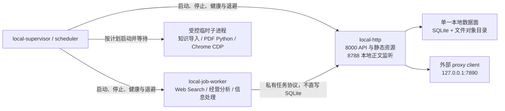

# 本地 Node 目标架构与整改 Todo

状态：全部 Todo 已完成；本地 Node 运行时已验收，旧 Wrangler 本地状态已退役

适用范围：`/Users/terry/git/stock-info` 本地开发运行时、进程、任务、SQLite 与本地工具链

不适用范围：生产 Cloudflare Worker 的业务能力重写

最后更新：2026-08-09

## 1. 文档用途

本文把本地运行时从 Wrangler/Miniflare 迁移到 Node 后仍未收敛的架构问题，整理为可逐项执行、验证和关闭的任务。

Todo 使用稳定编号。状态只使用以下五种值：

- `pending`：尚未开始；
- `in_progress`：正在实施，必须填写执行记录；
- `implementation_complete`：代码、迁移、脚本和文档已完成，按本次执行顺序等待统一验证；
- `blocked`：存在明确阻断，必须记录阻断证据和解除条件；
- `done`：实现、验证、文档和清理均已完成。

勾选框标记开发工作已完成；只有状态为 `done` 才表示实现、验证、文档和清理都已关闭。`implementation_complete` 仍须在 P6 统一验收后转为 `done`。

## 2. 已确认的架构结论

### 2.1 保留的正确边界

Hono 是两套运行时共享的 HTTP 路由框架，不是本地运行时：

```text
共享业务核心：Hono + Web Request/Response + Bindings
├─ 生产：Cloudflare Worker + D1 + R2 + Assets
└─ 本地：Node + SQLite + 文件对象存储 + web/dist
```

以下边界继续保留：

1. `src/app/router.ts` 是唯一 HTTP 路由装配点。
2. `src/app/scheduled.ts` 是生产和本地共享的定时业务分发点。
3. `src/app/worker.ts` 只负责 Cloudflare `fetch`、`scheduled` 适配。
4. `src/platform/node/*` 只负责本地 HTTP、SQLite、文件系统和进程能力。
5. `src/modules/*`、`src/app/*` 的共享业务代码不得直接依赖 `node:*`。
6. 生产固定 `LLM_RUNTIME=production`，不得增加模型调用例外或回退。

### 2.2 当前未完成的迁移

当前只是请求运行时切换到了 Node，本地控制面和数据面尚未完全脱离 Wrangler：

- Node API 使用 `data/local/stock-info.sqlite`；
- 部分统计、清理、seed、retention 和 migration 脚本仍执行 `wrangler d1 execute --local`；
- `.wrangler/state` 下仍存在另一套 Miniflare D1；
- `start-local.sh` 仍以多个 `nohup`、PID 文件和命令字符串管理进程；
- Web Search runner 可能跨源码变更复用旧进程；
- macro relay、runner 拆分和 watchdog 兼容代码仍带有 Wrangler 故障时期的所有权假设。

因此本轮整改的首要目标不是简单减少进程数量，而是先建立单一数据源、明确进程所有者和可恢复的任务协议。

## 3. 不可变约束

整改过程中必须始终满足：

1. Wrangler 只用于生产打包、dry-run、远端 D1 migration、R2 检查和部署。
2. 所有本地业务读写只落到显式 `LOCAL_DB_PATH`，默认 `data/local/stock-info.sqlite`。
3. 旧 `.wrangler/state` 数据在完成表级清点和迁移决策前不得删除。
4. 浏览器关闭、刷新或切换页面不得取消已经入队的长任务。
5. HTTP 进程重启不得把仍合法的 `queued` 任务批量标记为失败。
6. 旧 attempt、旧 lease 或旧 runner 的迟到结果不得覆盖新 attempt。
7. 股票 K 线仍只使用 Xueqiu；不得借架构整改增加其他 K 线来源或回退。
8. 外部 proxy client 是跨仓依赖，不伪装成本仓内部服务，也不由业务模块隐式拉起。
9. 本地 Node 成为平台实现，不得扩散成共享业务代码的直接依赖。
10. 生产 Cloudflare Worker 仍是事件驱动运行时，不描述或实现为本地长驻 Node 服务。

## 4. 目标架构

### 4.1 目标进程拓扑

本仓最终只保留三个受统一生命周期管理的常驻角色：



角色职责：

| 角色 | 唯一职责 | 不负责 |
| --- | --- | --- |
| `local-supervisor / scheduler` | 构建后启动、信号传播、健康检查、受控重启、定时触发、临时子进程回收 | 业务路由、LLM 解析、直接修改任务结果 |
| `local-http` | Hono API、静态资源、本地 bindings、SQLite/文件数据面、正文监听、任务状态机 | 持有长时间模型流、启动散装后台守护进程 |
| `local-job-worker` | 统一领取和执行三类 LLM 任务，维护 handler 级并发、心跳和 checkpoint | 直接访问 SQLite、提供用户页面 |
| 临时子进程 | 一次知识导入、PDF 转换、Cookie 刷新等有明确开始和结束的工作 | 常驻轮询、独立 PID 文件 |

### 4.2 服务合并与删除决策

| 当前组件 | 目标归属 | 决策 |
| --- | --- | --- |
| Node HTTP `:8000` | `local-http` | 保留 |
| knowledge content/converter `:8788` | `local-http` 的第二监听器；Python 转换为受控子进程 | 合并进程，保留跨 origin 行为 |
| macro fetch relay `:8791` | 无 | 删除，Node 直接访问 allowlist 官方源 |
| Web Search runner | `local-job-worker` handler | 合并 |
| operating-analysis runner | `local-job-worker` handler | 合并，保留独立并发配置 |
| information-processing runner | `local-job-worker` handler | 合并，修正生产者/消费者开关 |
| Node cron runner | `local-supervisor / scheduler` | 合并，不模拟 `/cdn-cgi` 请求 |
| knowledge ingest scheduler | `local-supervisor / scheduler` | 合并，执行体改为受控一次性子进程 |
| Xueqiu Cookie shell loop | `local-supervisor / scheduler` | 合并，刷新后动态更新本地 credential，不重启 HTTP |
| 外部 proxy relay `:7890` | 仓外依赖 | 保留显式健康门禁 |
| Wrangler CLI | 生产工具链 | 删除所有 `--local` 使用，保留 remote/dry-run/deploy |

### 4.3 数据与调用方向

```text
浏览器
  -> local-http
       -> application/domain
       -> LocalD1Database -> data/local/stock-info.sqlite
       -> LocalR2Bucket   -> data/local/*

local-job-worker
  -> 私有 claim/checkpoint/complete/fail 协议
  -> local-http
  -> 由 local-http 统一提交 SQLite 状态变化

local-supervisor / scheduler
  -> 调用共享 scheduled 分发或受控内部端口
  -> 启动并等待一次性本地维护任务
```

不得新增第二个隐式 SQLite 路径。确实需要批量脚本直接连接 SQLite 时，必须显式使用同一个 `LOCAL_DB_PATH`、启用统一锁等待策略，并在任务定义中声明其写入范围。

## 5. 总体进度

| 阶段 | 状态 | 完成数 | 总数 | 完成条件 |
| --- | --- | ---: | ---: | --- |
| P0 现场清点与安全边界 | done | 4 | 4 | 旧数据已归档退役，旧进程均有明确处置决定 |
| P1 单一本地数据面 | done | 6 | 6 | 本地执行路径不再调用 Wrangler local |
| P2 统一任务与 lease 协议 | done | 6 | 6 | 三类任务拒绝陈旧 attempt 回写 |
| P3 统一进程生命周期 | done | 6 | 6 | 所有常驻角色由一个前台 supervisor 管理 |
| P4 合并和删除历史服务 | done | 5 | 5 | 默认常驻角色收敛为目标拓扑 |
| P5 代码所有权与文档清理 | done | 5 | 5 | 无重复 owner 和错误运行时术语 |
| P6 端到端验收与旧状态退役 | done | 6 | 6 | 本地与生产边界均有真实证据 |

## 6. 分阶段 Todo

### P0：现场清点与安全边界

- [x] `ARCH-P0-001` 清点 Node SQLite 与 Miniflare D1。
  - 状态：`done`
  - 输出：关键表的 schema、行数、最大更新时间、仅存在于一侧的表和数据。
  - 至少覆盖：证券、K 线、知识文档、知识处理、研究任务、宏观、情境。
  - 完成证据：保存对比报告；明确 `migrate / archive / discard` 决策，不以文件大小代替内容核验。

- [x] `ARCH-P0-002` 备份待退役的 `.wrangler/state`。
  - 状态：`done`
  - 依赖：`ARCH-P0-001`
  - 完成证据：记录备份位置、生成时间、大小和校验值；验证可读取。

- [x] `ARCH-P0-003` 清点并安全停止遗留进程。
  - 状态：`done`
  - 范围：旧 cron、旧 Web Search runner、stale PID、旧 watchdog、无监听但仍轮询的进程。
  - 完成证据：停止前记录 PID/命令/启动时间；停止后确认 8000、8788、8791 与 PID 文件状态。

- [x] `ARCH-P0-004` 建立整改前基线报告。
  - 状态：`done`
  - 输出：当前进程树、端口、健康状态、数据库路径、任务状态分布、日志大小。
  - 完成证据：报告包含采集命令和时间，后续 P6 使用同一口径对比。

### P1：单一本地数据面

- [x] `ARCH-P1-001` 统一本地 SQLite 路径解析。
  - 状态：`done`
  - 实现要求：所有本地工具复用一个路径解析和数据库打开模块；默认 `data/local/stock-info.sqlite`，支持显式 `LOCAL_DB_PATH`。
  - 完成证据：单元测试覆盖默认路径、绝对覆盖路径、数据库不存在和缺表错误。

- [x] `ARCH-P1-002` 改造本地统计与报告脚本。
  - 状态：`done`
  - 范围：`report-knowledge-storage.mjs` 及其调用链。
  - 要求：本地直接读取 Node SQLite；远端继续使用 Wrangler remote。
  - 完成证据：统计结果中的数据库路径等于 `LOCAL_DB_PATH`，且不会创建或更新 `.wrangler/state`。

- [x] `ARCH-P1-003` 改造本地 cleanup、seed、retention 和 migration。
  - 状态：`done`
  - 范围：knowledge docs/content cleanup、sample seed、knowledge retention prune、localfs migration 等全部本地分支。
  - 完成证据：dry-run 与 apply 均命中 Node SQLite；remote 分支仍显式命中 Cloudflare。

- [x] `ARCH-P1-004` 统一 SQLite 并发策略。
  - 状态：`done`
  - 要求：评估并明确 WAL、`busy_timeout`、批量事务、一次性批处理与 HTTP 写入的并发边界。
  - 完成证据：API 读写与一次批量导入并行时无错误、无静默跳过，锁等待可观测。

- [x] `ARCH-P1-005` 增加禁止 Wrangler local 的门禁。
  - 状态：`done`
  - 要求：新增静态检查，禁止可执行本地路径出现 `wrangler ... --local`；允许 production remote/dry-run/deploy。
  - 完成证据：植入一个受控违规样例时检查失败，移除后通过。

- [x] `ARCH-P1-006` 更新本地数据文档和命令帮助。
  - 状态：`done`
  - 依赖：`ARCH-P1-001` 至 `ARCH-P1-005`
  - 完成证据：README、运行时文档和脚本 `--help` 不再把本地数据库称为 Wrangler D1。

### P2：统一任务、attempt 与 lease 协议

- [x] `ARCH-P2-001` 定义统一任务状态机。
  - 状态：`done`
  - 最小字段：`job_id`、`job_type`、`status`、`attempt`、`lease_owner`、`lease_until`、`heartbeat_at`、`created_at`、`started_at`、`updated_at`、`completed_at`、`last_error`。
  - 状态机：`queued -> running -> completed|failed`；中断只能通过 lease 过期进入可重试状态。
  - 完成证据：状态迁移表、数据库约束和并发 claim 测试。

- [x] `ARCH-P2-002` 修复 Web Search 任务所有权。
  - 状态：`done`
  - 要求：增加 attempt/owner；删除启动时批量失败 `queued/running` 的策略；旧 attempt 的 complete/fail 必须被拒绝。
  - 完成证据：模拟 runner A 超时、runner B 重新领取、A 迟到完成，最终只能接受 B。

- [x] `ARCH-P2-003` 加固 operating-analysis stage 写入。
  - 状态：`done`
  - 要求：stage start/checkpoint/complete 与最终 job complete 使用同一 attempt 和 lease_owner 条件。
  - 完成证据：lease 转移后旧 stream 的 checkpoint 和 complete 均不改变新任务。

- [x] `ARCH-P2-004` 对齐 information-processing 的生产者与消费者。
  - 状态：`done`
  - 要求：配置开启自动 enqueue 时，统一 job worker 必须启用对应 handler；并发配置由同一来源控制。
  - 完成证据：一次自然 ingest 后队列不会持续增长为无人消费状态。

- [x] `ARCH-P2-005` 统一 provider、并发、额度和审计入口。
  - 状态：`done`
  - 要求：三个 handler 共享 provider registry 和总额度门禁，同时保留 handler 独立并发上限。
  - 完成证据：运行态可同时看到全局占用和各 handler active/queued 数量。

- [x] `ARCH-P2-006` 实现优雅停止和任务恢复。
  - 状态：`done`
  - 要求：SIGTERM 停止领取新任务；在途流完成 checkpoint 或明确 requeue；超时后强制退出并保留可恢复状态。
  - 完成证据：真实长任务中途停止并重启后，从最后合法阶段恢复且不重复接受旧结果。

### P3：统一进程生命周期

- [x] `ARCH-P3-001` 实现前台 local supervisor。
  - 状态：`done`
  - 要求：`start-local.sh` 最终 `exec` 前台 supervisor；禁止以散装 `nohup` 作为默认管理方式。
  - 完成证据：父进程退出后所有仓内子进程均退出，不产生孤儿进程。

- [x] `ARCH-P3-002` 分离 build 与 serve 命令。
  - 状态：`done`
  - 要求：启动流程只 build prompts/web/node 一次；重启 HTTP 或 job worker 不重新构建前端。
  - 完成证据：启动日志中每类 build 只出现一次；Cookie 刷新不触发 build。

- [x] `ARCH-P3-003` 建立精确进程所有权。
  - 状态：`done`
  - 要求：supervisor 保存 child handle，不按模糊命令字符串或任意端口杀进程；不得杀死非本仓 listener。
  - 完成证据：8000 被无关测试进程占用时启动明确失败，且不终止该进程。

- [x] `ARCH-P3-004` 统一健康、退避和故障传播。
  - 状态：`done`
  - 要求：HTTP、job worker、scheduler 子组件分别有 readiness/liveness；重启有上限和退避；核心角色永久失败时 supervisor 非零退出。
  - 完成证据：分别杀死 HTTP 和 job worker，观察符合配置的恢复或显式失败。

- [x] `ARCH-P3-005` 统一结构化日志。
  - 状态：`done`
  - 最小字段：时间、role、pid、run_id、job_id、attempt、event、duration_ms、error。
  - 完成证据：一个用户任务能跨 HTTP enqueue、worker claim、provider、checkpoint、complete 关联查询。

- [x] `ARCH-P3-006` 删除旧 watchdog、旧 PID 和 runner fingerprint 兼容路径。
  - 状态：`done`
  - 依赖：`ARCH-P3-001` 至 `ARCH-P3-005`
  - 完成证据：仓库和默认日志目录中不再生成旧 PID/fingerprint/watchdog 文件。

### P4：合并和删除历史服务

- [x] `ARCH-P4-001` 删除 macro fetch relay。
  - 状态：`done`
  - 要求：本地 Node 直接访问现有 allowlist 官方源；生产 Worker 保持直接 fetch。
  - 完成证据：FRED、BLS、HKMA、NY Fed 的本地同步与 source health 通过；8791 无 listener。

- [x] `ARCH-P4-002` 合并 knowledge content 服务。
  - 状态：`done`
  - 要求：由 `local-http` 同进程监听 8788，保持浏览器跨 origin、缓存头、压缩正文与转换 allowlist 契约。
  - 完成证据：正文 GET/HEAD/CORS、压缩内容、研报与 SEC 转换、并发上限测试通过。

- [x] `ARCH-P4-003` 合并三类 LLM runner。
  - 状态：`done`
  - 要求：一个 job worker 进程内注册三个 handler；禁止复制轮询、credential 解析、provider 初始化和信号处理。
  - 完成证据：三类任务分别成功；经营分析并发、Web Search 并发和信息处理并发符合配置。

- [x] `ARCH-P4-004` 合并本地 scheduler。
  - 状态：`done`
  - 要求：生产共享 cron 仍以 `wrangler.jsonc` 为单一计划来源；knowledge ingest 与 Cookie refresh 使用本地配置；同类任务不得重叠。
  - 完成证据：至少观察一次自然 scheduled run；重复触发被 lease 或 mutex 明确拒绝并记录。

- [x] `ARCH-P4-005` 改造 Xueqiu Cookie 动态更新。
  - 状态：`done`
  - 要求：候选 Cookie 通过真实 K 线验证后更新本地 credential store；HTTP 读取新值但不重启；生产变量更新仍只作为待部署配置，不自动部署。
  - 完成证据：刷新前后 HTTP PID 不变，新请求使用新 Cookie，失败不推进成功时间。

### P5：代码所有权与文档清理

- [x] `ARCH-P5-001` 增加显式运行时标识。
  - 状态：`done`
  - 要求：引入明确的 `APP_RUNTIME=node|cloudflare` 或等价绑定；本地写权限继续独立由 `LLM_RUNTIME=local` 控制。
  - 完成证据：Cloudflare `nodejs_compat` 下不会被误判为本地 Node。

- [x] `ARCH-P5-002` 清除重复路由 owner。
  - 状态：`done`
  - 范围：`local-data.routes.ts` 与 company/knowledge 路由中的重复路径。
  - 完成证据：每条 URL 只有一个注册 owner，不依赖路由挂载顺序。

- [x] `ARCH-P5-003` 拆分超大路由文件的应用编排。
  - 状态：`done`
  - 优先级：先 research job、knowledge processing，再处理其他领域。
  - 要求：路由只做协议解析与响应；状态机和编排进入 application 层，不做无关重构。
  - 完成证据：关键任务路由存在直接 application 契约测试。

- [x] `ARCH-P5-004` 删除无调用者兼容层。
  - 状态：`done`
  - 候选：未使用的 `src/routes/*`、`src/services/*` barrel、无语义的 local request wrapper、废弃 lease/直接 LLM 路径。
  - 完成证据：逐项 `rg` 证明无调用者；typecheck、构建和相关测试通过。

- [x] `ARCH-P5-005` 更新运行时术语和设计文档。
  - 状态：`done`
  - 要求：本地统一称 `Node runtime`、`local-http`、`job worker`；`Worker` 仅指生产 Cloudflare Worker。
  - 完成证据：README、AGENTS、运行文档、代码注释和错误消息一致。

### P6：端到端验收与旧状态退役

- [x] `ARCH-P6-001` 运行静态和模块验证。
  - 状态：`done`
  - 命令基线：`npm run typecheck`、`npm run test:local-runtime`、任务状态机测试、相关领域测试。
  - 完成证据：保存命令、时间、退出码和失败明细；不得用浅层测试代替运行态证明。

- [x] `ARCH-P6-002` 证明单一数据库写入。
  - 状态：`done`
  - 场景：API 写入、knowledge ingest、cleanup dry-run/apply、storage report。
  - 完成证据：所有结果均可从同一 `LOCAL_DB_PATH` 读取；`.wrangler/state` 无 mtime/大小变化。

- [x] `ARCH-P6-003` 证明目标进程拓扑。
  - 状态：`done`
  - 完成证据：记录进程树、父子关系、监听端口和角色健康；停止后无仓内孤儿进程和 stale PID。

- [x] `ARCH-P6-004` 证明真实用户任务。
  - 状态：`done`
  - 场景：页面 smoke、Web Search 包、经营分析、信息处理、自然 cron、knowledge ingest、正文与 PDF 转换。
  - 完成证据：从 UI/API enqueue 到持久化终态的完整时间线；至少一次中途重启恢复。

- [x] `ARCH-P6-005` 验证生产 Cloudflare 边界。
  - 状态：`done`
  - 要求：运行 Worker dry-run；检查 `LLM_RUNTIME=production`、D1/R2/Assets/cron 绑定；不执行未经授权的生产部署。
  - 完成证据：`npx wrangler deploy --dry-run` 成功，生产包不引用 `src/platform/node/*`。

- [x] `ARCH-P6-006` 退役旧 `.wrangler` 本地状态。
  - 状态：`done`
  - 依赖：`ARCH-P0-001`、`ARCH-P0-002`、`ARCH-P6-002`、`ARCH-P6-005`
  - 要求：只有在数据已迁移或确认可废弃、备份可读、全部本地命令不再访问后才能执行。
  - 完成证据：记录删除目标、备份位置、恢复方式和删除后验证结果。

## 7. 执行依赖与建议批次

```text
P0 数据/进程清点
  -> P1 单一本地数据面
       -> P2 任务 attempt/lease
            -> P3 supervisor 与生命周期
                 -> P4 服务合并/删除
                      -> P5 所有权和文档清理
                           -> P6 真实验收与旧状态退役
```

建议按以下批次提交，避免一个变更同时改动数据、任务和进程所有权：

1. 批次 A：`P0 + P1`，只解决数据路径和安全门禁。
2. 批次 B：`P2`，只解决任务正确性，不合并进程。
3. 批次 C：`P3`，引入 supervisor 和纯运行命令。
4. 批次 D：`P4`，逐个合并 runner、scheduler、content，删除 macro relay。
5. 批次 E：`P5 + P6`，清理所有权并完成本地/生产双边界验收。

每个批次完成后都要先更新本文状态和证据，再开始下一个批次。

## 8. 完成定义

整体整改只有同时满足以下条件才能标记完成：

- 本地没有任何 Wrangler/Miniflare 运行时或 `--local` 数据访问；
- 所有本地业务数据只有一个显式 SQLite 来源；
- 默认启动只有目标架构中的三个常驻角色和明确的仓外 proxy；
- 所有子进程都由 supervisor 持有并能被统一停止；
- 三类 LLM 任务共享 worker 基础设施，但保留独立并发和任务契约；
- 旧 attempt 无法写入新任务，长任务可从合法 checkpoint 恢复；
- Cookie 刷新不重启 HTTP，不自动部署生产；
- 本地真实页面、API、自然定时任务和长模型任务通过；
- Cloudflare dry-run 通过，生产仍禁止 LLM；
- 旧 `.wrangler/state` 已按记录完成迁移、归档或安全退役；
- README、AGENTS 和设计文档与实际进程、命令、数据路径一致。

## 9. 执行记录

每次推进至少新增一行：

| 日期 | Todo ID | 状态变化 | 修改文件/提交 | 验证证据 | 遗留风险/阻断 |
| --- | --- | --- | --- | --- | --- |
| 2026-08-09 | 文档初始化 | `pending` | `docs/local-node-runtime-target-architecture-todo.md` | 完成现状、目标架构、阶段任务和完成定义 | 尚未实施代码整改 |
| 2026-08-09 | `ARCH-P0-001` 至 `ARCH-P0-004` | `done` | `scripts/audit-local-runtime.mjs`、`docs/runtime-audits/`、`data/local/retired-wrangler-state/` | 已清点、归档并退役原始 `.wrangler/state`，保留可校验归档 | 无 |
| 2026-08-09 | `ARCH-P1-001` 至 `ARCH-P1-006` | `done` | `scripts/lib/local-d1-sqlite.mjs`、本地 maintenance 脚本、`scripts/check-no-wrangler-local.mjs`、运行文档 | 报告、cleanup dry-run/apply、ingest 与 API 均读取同一 `LOCAL_DB_PATH` | 无 |
| 2026-08-09 | `ARCH-P2-001` 至 `ARCH-P2-006` | `done` | `migrations/0105_local_job_protocol.sql`、`src/shared/local-job-protocol.ts`、三类任务 application/runner | 真实 Web Search 作业从 lease 过期恢复至 attempt 2 并持久化完成 | 无 |
| 2026-08-09 | `ARCH-P3-001` 至 `ARCH-P3-006` | `done` | `start-local.sh`、`scripts/local-supervisor.mjs`、`scripts/lib/local-runtime-log.mjs`、`src/platform/node/local-server.ts`、`src/platform/node/local-cron.ts` | 隔离实例验证父子拓扑、250ms 退避恢复、端口占用拒绝及无孤儿退出 | 无 |
| 2026-08-09 | `ARCH-P4-001` 至 `ARCH-P4-005` | `done` | macro adapter、content server、`scripts/local-job-worker.mjs`、scheduler、local credential store | 8788 合并、`.md.br` GET/HEAD/CORS 和自然 ingest 均有运行态证据 | 无 |
| 2026-08-09 | `ARCH-P5-001` 至 `ARCH-P5-005` | `done` | `src/shared/request.ts`、`src/platform/node/`、路由/application 清理、README/设计文档 | Worker dry-run 包未包含 Node 平台实现 | 无 |
| 2026-08-09 | 验收暂停 | `deferred_until_implementation_complete` | `docs/local-node-runtime-target-architecture-todo.md` | 用户要求先完成所有开发项，再统一编译和运行验收；已停止本地 supervisor | P6 仍全部 pending，开发项收口后才恢复最终验证 |
| 2026-08-09 | `ARCH-P6-001` | `done` | `package.json`、`scripts/smoke-pages.mjs`、`src/shared/http.ts` | `build:local`、typecheck、local-runtime、research 252、information-processing 8、macro 和页面 smoke 89 均通过；并修复域名并发等待的未定义变量 | 冻结代表性研究包须显式提供独立 fixture 才执行 |
| 2026-08-09 | `ARCH-P6-002` 至 `ARCH-P6-004` | `done` | `docs/runtime-audits/local-runtime-final-2026-08-09.md`、supervisor JSON 日志 | report/cleanup/API/ingest 使用 `/Users/terry/git/stock-info/data/local/stock-info.sqlite`；8788 Brotli/CORS 已验证；真实 Web Search `queued → attempt 1 → lease expired → attempt 2 → completed`；隔离 supervisor 验证恢复与无孤儿 | 无 |
| 2026-08-09 | `ARCH-P6-005` | `done` | `wrangler.jsonc`、Worker dry-run outdir | `npx wrangler deploy --dry-run` 成功；`APP_RUNTIME=cloudflare`、`LLM_RUNTIME=production`；788 个 source map 源无 `src/platform/node` 命中；未部署 | 无 |
| 2026-08-09 | `ARCH-P6-006` | `done` | `data/local/retired-wrangler-state/wrangler-state-20260809T103800+0800.tar.gz` | SHA-256 `18ea6b9bd6f1b54b22b0fc0c110ae007339c4a09f40a1c6c41889cfb5b0eff1c` 和 `tar -tzf` 均通过；仓内 `.wrangler/state` 已移至系统废纸篓，最终审计/health 正常。恢复优先解压归档到仓内 `.wrangler/state`，废纸篓副本仅作短期可恢复删除 | 无 |

## 10. 决策记录

| 决策 ID | 决策 | 理由 | 重新评估条件 |
| --- | --- | --- | --- |
| ADR-LR-001 | 本地继续使用 Node，不恢复 Wrangler local runtime | Hono 不是运行时；Node 提供 HTTP、SQLite、文件、脚本和进程能力，同时避开已出现的 Miniflare/ProxyController 故障 | Node 平台出现可复现且无法在适配层修复的运行时缺陷 |
| ADR-LR-002 | 生产 Cloudflare 与本地 Node 共用业务核心，保留两个薄适配器 | 保持生产部署形态，同时让本地运行不依赖 Wrangler | 共享业务代码无法继续遵守 Web API/Bindings 边界 |
| ADR-LR-003 | 长 LLM 任务保留独立 job worker 进程，但三类 runner 合并 | Wrangler 不再要求外置；独立进程仍提供长连接、并发和故障隔离 | 真实运行证据证明单进程更可靠且不会耦合 HTTP 生命周期 |
| ADR-LR-004 | Wrangler 只保留生产职责 | 避免本地 Node SQLite 与 Miniflare D1 split-brain | Cloudflare 提供不会创建第二数据面的官方 Node SQLite 适配方案 |
| ADR-LR-005 | knowledge content 保留 8788 语义但并入 `local-http` 进程 | 保留浏览器跨 origin/CORS 契约，无需独立生命周期 | 内容转换负载出现可复现的 HTTP 隔离需求 |
