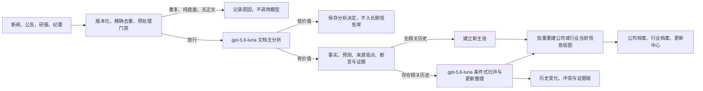

# 研究信息理解与知识整理系统设计方案

> 状态：设计确认，待实施  
> 版本：0.4  
> 日期：2026-08-03

## 1. 目标

建立一套面向新闻、公告、研报、会议纪要和其他研究材料的长期信息理解与整理系统。系统使用 Luna 理解每份内容，准确识别主要对象，并提取来源明确表达的信息、已披露事实、管理层指引、第三方预测和来源观点，再按公司、行业、产品、型号、指标和时间等维度归并、更新和展示。

现阶段不生成系统自己的分析结论，不推演业务影响，不提出投资判断，也不把模型推断写入知识库。模型只忠实整理来源说了什么，以及不同来源之间如何相同、补充、修正或冲突。

是否增加系统分析结论属于后续独立产品决策。本方案不预建相关表、提示词、接口或页面，避免当前实现被未确认的未来能力复杂化。

系统需要回答：

1. 截至某个时间点，我们对一家公司或行业知道什么；
2. 哪些内容是已披露数据、管理层指引、第三方预测或观点；
3. 每条信息来自哪里，原文位于哪一页、哪一段或哪个表格；
4. 新内容相对历史内容是新增、补充、修正、冲突、撤回还是验证；
5. 哪些旧信息已经不应出现在当前总结中，以及为什么；
6. 公司或行业的最新事实、预测、观点、分歧和数据缺口是什么；
7. 一篇内容主要描述哪个公司或行业，其他被提及实体分别扮演什么角色；
8. 同一个事实、预测或观点在不同时间和来源中如何新增、修正、冲突或失效；
9. 哪些内容可以在调用模型前确定为重复、纯盘面或无有效正文，哪些内容应由模型判定为低价值。

本系统独立于态势感知、交易信号和动作候选。知识沉淀可以被其他功能读取，但自身不生成买卖建议，也不依赖态势功能的事件或信号模型。

## 2. 核心设计决策

### 2.1 现阶段只做信息理解、提取和整理

完整链路为：

```text
原文 -> 证据片段 -> 来源断言 -> 规范化主张 -> 公司或行业当前信息视图
```

模型负责回答：

- 这份内容主要在说什么，是否值得长期保存；
- 主要描述哪个公司、行业、产品或型号；
- 来源明确陈述了哪些事实、指引、预测和观点；
- 每条信息的时间、口径、单位、适用范围和原文证据是什么；
- 新信息与历史信息是新增、支持、补充、修正、冲突还是撤回；
- 应如何按公司、行业和其他维度整理展示。

模型可以忠实概括来源自己的论证和观点，但不能在来源内容之外形成系统结论。例如，来源认为“X型号将成为增长驱动”，系统可以将其保存为来源观点；系统不能自行推断“因此A公司未来两年利润将加速”。

系统提供三层处理：

| 处理层级 | 输入 | 核心输出 |
| --- | --- | --- |
| 单篇内容理解 | 一篇新闻、公告、研报或纪要 | 价值、主体归属、事实、指引、预测、来源观点、证据和来源摘要 |
| 跨内容整理 | 新断言与历史主张 | 新增、支持、补充、冲突、修正、撤回和失效关系 |
| 公司或行业信息视图 | 当前有效主张、来源观点和冲突 | 最新事实、预测、观点、历史变化、分歧和数据缺口 |

### 2.2 Luna 是唯一语义引擎

所有需要理解内容含义的步骤统一使用：

```text
model = gpt-5.6-luna
```

包括：

- 判断内容中哪些信息值得沉淀；
- 识别公司、行业、产品、型号、技术、客户和地区；
- 提取事实、指引、预测、观点、事件和关系；
- 判断两个表述是否属于同一现实命题；
- 判断新旧信息是支持、补充、修正、冲突、撤回还是验证；
- 生成忠于来源的文档摘要；
- 生成公司和行业的当前信息整理视图；
- 对高风险、校验失败或抽样内容进行独立复核。

知识处理不设置其他模型作为自动降级。请求失败时只能使用同一模型重试；实际返回模型不符合预期时，任务必须失败并显示原因。

### 2.3 一次主分析尽可能完成整篇理解

对普通新闻、公告和篇幅可控的研报，每份内容优先只执行一次“文档主分析”。同一次 Luna 调用同时输出：

- 是否值得进入长期信息库及原因；
- 文档类型、时间范围和内容质量；
- 主要公司、行业或产品归属；
- 其他实体的客户、供应商、同业、股东、引用方或顺带提及角色；
- 事实、指引、预测、观点、事件和关系；
- 每条断言的原文证据；
- 文档摘要、关键词和后续归并提示；
- 不确定性和是否需要复核。

只有跨文档历史关系、超长文档合并、受影响实体视图重建或风险复核确实需要额外上下文时，才追加模型调用。不能把可以在一次主分析中完成的实体识别、价值判断、摘要和断言提取拆成多个固定调用。

### 2.4 工程预处理采用高精度门禁

在模型调用前，工程代码可以剔除无需语义理解就能确定没有长期沉淀价值的内容：

- 完全重复的来源 ID、规范化 URL、文件哈希或正文哈希；
- 来源明确标记为纯行情、盘口或行情榜单的数据类型；
- 可以由来源模板精确识别的纯价格、涨跌幅、成交额、换手率、资金流、龙虎榜、融资余额和盘中异动播报；
- 空正文、抓取错误页、登录提示、免责声明页和只有模板占位符的内容；
- 同一来源、同一时间窗口、正文核心完全一致的高置信度模板转载。

工程门禁以精确来源字段和高精度模板为主，不能只因正文出现“涨停”“资金流”“成交额”等词就丢弃内容。包含经营原因、公司公告、订单、产能、产品或行业解释的内容仍应进入 Luna。任何不确定内容默认放行给模型判断。

所有预处理丢弃结果都要保存原因码、规则版本和文档哈希，能够审计和重新处理。规则放入版本化配置，不散落在业务代码中。

### 2.5 工程代码只做机械辅助

工程代码可以：

- 采集、下载、版本化和去除字节级重复；
- 按明确来源类型和高精度模板执行预模型门禁；
- PDF 转 Markdown、OCR、分页、标题识别和表格保留；
- 按结构切分全文并调度模型任务；
- 校验 JSON Schema、字段类型和枚举；
- 检查引用文本是否确实存在于原文；
- 检查数值和单位是否与引用片段机械一致；
- 从数据库中检索可能相关的历史主张，交给 Luna 判断；
- 管理队列、并发、重试、缓存、存储和状态迁移；
- 根据模型输出重建受影响的公司或行业视图。

工程代码不可以：

- 用宽泛关键词、模糊评分或主题联想判断内容价值；
- 用字段相等或字符串相似直接判定两个信息语义相同；
- 自行判断预测是否被替代、事实是否过期或观点是否错误；
- 把未被模型和证据支持的内容补进总结；
- 因模型失败而切换到另一种语义提取实现。

代码配置可以限制采集范围，并剔除定义明确、可机械证明的低价值类型；除此之外，采集后的语义价值和公司归属统一由 Luna 判断。

### 2.6 原始信息不被覆盖

原始文档版本、证据片段和来源断言均采用追加式记录。所谓“剔除旧信息或旧观点”，是指它们不再进入当前信息视图，而不是从数据库物理删除。

历史查询必须支持 `asOf`：回看某一天时，只使用当时已经取得的文档、断言、模型判断和词典版本，不能读取未来修正结果。

## 3. 模型和工程职责边界

| 工作 | `gpt-5.6-luna` | 工程代码 |
| --- | --- | --- |
| 精确去重和过滤明确盘面模板 | 否 | 是 |
| 判断放行内容是否有沉淀价值 | 是 | 否 |
| 判断文档的主要公司或行业归属 | 是 | 否 |
| 区分主要主体和顺带提及实体 | 是 | 否 |
| 提取事实、预测、观点和关系 | 是 | 否 |
| 识别语义主体和业务口径 | 是 | 否 |
| 判断两条信息是否表达同一命题 | 是 | 否 |
| 判断支持、冲突、修正和替代关系 | 是 | 否 |
| 生成公司或行业当前总结 | 是 | 否 |
| 生成新旧视图变化说明 | 是 | 否 |
| PDF 转文字、OCR、分页和切块 | 否 | 是 |
| JSON Schema 和字段类型校验 | 否 | 是 |
| 原文引用精确匹配 | 否 | 是 |
| 任务编排、缓存、重试和存储 | 否 | 是 |
| 执行模型已给出的状态变化 | 否 | 是 |

## 4. 总体架构



系统分为五层：

1. 原文层：不可变文档版本和原始内容；
2. 证据层：可以精确定位的原文片段、表格和图表；
3. 断言层：单一来源具体声称了什么；
4. 主张层：跨来源归并后的现实命题及其状态；
5. 视图层：截至指定时间的公司或行业事实、预测、来源观点、冲突和变化整理。

## 5. 领域模型

### 5.1 文档 Document

一篇新闻、公告、研报、会议纪要或其他材料的不可变捕获版本。文档是来源记录，不是已验证结论。

保存：

- 来源、标题、作者和机构；
- 发布时间、抓取时间和事件时间；
- 原始 URL、文件哈希和内容哈希；
- PDF、网页快照、Markdown 或其他原始内容；
- 页码、标题层级、段落、表格和图片位置；
- 访问方式、版权和保存期限策略。

同一 URL 的正文发生变化时生成新版本，不覆盖旧版本。

### 5.2 证据片段 Evidence Span

文档版本中可以精确定位的原句、表格单元格、图表值或页码范围。它用于支持、质疑、修正或撤回一个断言。

证据片段至少包含：

```text
document_version_id
chunk_id
page_number
section_path
paragraph_or_table_position
exact_quote
image_region_or_table_coordinates
content_hash
```

整篇文章不能直接作为断言证据。模型必须返回具体引用，工程代码必须验证引用可以在对应文档版本中定位。

### 5.3 文档主分析结果 Document Analysis

文档主分析是普通内容的核心模型调用。它不是单独的摘要或字段提取，而是一次完成价值判断、归属识别、实体角色、断言提取、来源观点识别和文档整理的结构化产物。

建议输出：

```json
{
  "retentionDecision": {
    "action": "retain_structured",
    "valueLevel": "high",
    "reasonCodes": ["specific_operating_metric", "durable_company_information"],
    "rationale": "包含可验证的型号出货预测和产能变化"
  },
  "classification": {
    "documentType": "company_research_report",
    "scope": "company",
    "timeRange": {"start": "2026-01-01", "end": "2026-12-31"}
  },
  "attribution": {
    "primarySubjects": [
      {
        "entityType": "company",
        "name": "A公司",
        "codeCandidate": "000001.SZ",
        "confidence": 0.98,
        "evidence": "标题及正文主要分析A公司的产品、收入和预测"
      }
    ],
    "mentions": [
      {"name": "B公司", "role": "peer", "evidence": "与B公司进行同业比较"},
      {"name": "C公司", "role": "customer", "evidence": "C公司为下游客户"}
    ],
    "unresolvedEntities": []
  },
  "entities": [],
  "assertions": [],
  "keyAssertionRefs": ["assertion-1", "assertion-2"],
  "documentSummary": "...",
  "reconciliationHints": [],
  "quality": {
    "contentComplete": true,
    "needsReview": false,
    "uncertainties": []
  }
}
```

`retentionDecision.action` 至少支持：

- `retain_structured`：进入正式信息库；
- `retain_summary_only`：有一定背景价值，但没有足够稳定的原子断言；
- `discard_low_value`：语义上缺乏长期沉淀价值；
- `needs_review`：正文、归属或证据不足，暂不自动入账。

低价值决定仍保存模型、提示词版本、原因和文档哈希，避免相同内容反复调用模型。

### 5.4 主要主体和提及角色

一篇文档可以有零个、一个或多个主要主体。Luna 必须区分：

- `primary_subject`：文档主要描述或研究的公司、行业、产品或主题；
- `peer`：用于对比的同业公司；
- `customer`：客户或下游；
- `supplier`：供应商或上游；
- `shareholder`：股东或被持股对象；
- `industry_member`：行业成员但不是文档主角；
- `quoted_party`：仅被引用观点；
- `incidental_mention`：顺带提及，没有文档归属关系。

公司页面的文档归属只能来自 `primary_subject`。其他角色用于关系检索和证据展示，不能因为正文出现公司名称就把文档归到该公司。

来源元数据、标题代码、文件名和已有别名可以作为模型输入提示，但不能覆盖模型判断。模型判断与可靠来源元数据冲突时进入复核队列，不静默选择任一方。

### 5.5 来源断言 Assertion

从一份文档的证据片段中提取出的一个原子陈述。断言描述“这个来源声称什么”，不自动等于真实事实。

断言类型包括：

- `reported_actual`：来源报告的已发生数据或事实；
- `management_guidance`：公司或管理层指引；
- `third_party_forecast`：券商、研究机构或其他第三方预测；
- `opinion`：判断、解释、因果观点或投资观点；
- `event`：发生、计划发生或可能发生的事件；
- `relationship`：供应、客户、竞争、产业链或控制关系。

建议的结构化输出：

```json
{
  "assertionType": "third_party_forecast",
  "subject": {
    "entityType": "company",
    "entityId": "optional-canonical-id",
    "name": "A公司"
  },
  "predicate": {
    "predicateId": "shipment_volume",
    "proposedPredicate": null
  },
  "value": {
    "kind": "number",
    "value": 120,
    "minimum": null,
    "maximum": null,
    "unit": "万台",
    "currency": null
  },
  "dimensions": {
    "product": "X产品",
    "model": "X型号",
    "region": "中国",
    "customer": null,
    "businessLine": null
  },
  "period": {
    "label": "2026年",
    "start": "2026-01-01",
    "end": "2026-12-31"
  },
  "modality": "forecast",
  "speaker": "某研究机构",
  "qualifiers": [],
  "evidenceSpans": [
    {
      "chunkId": "chunk-12",
      "pageNumber": 12,
      "exactQuote": "预计2026年X型号发货量达到120万台"
    }
  ],
  "extractionConfidence": 0.96,
  "uncertainties": []
}
```

`extractionConfidence` 只表示模型是否确信自己准确理解了原文，不表示来源内容本身真实。

### 5.6 规范化主张 Canonical Claim

规范化主张是独立于具体来源的现实命题，用来聚合来自不同来源的等价、补充或冲突断言。

Luna负责判断新断言与已有主张之间的关系：

| 关系 | 含义 |
| --- | --- |
| `new` | 新的独立命题 |
| `supports` | 支持已有主张 |
| `supplements` | 补充已有主张的新维度或条件 |
| `revises` | 同一来源或同一预测体系的新版本 |
| `contradicts` | 与已有断言在相同口径下冲突 |
| `corrects` | 来源明确修正旧数据或旧表述 |
| `retracts` | 来源明确撤回旧内容 |
| `resolves` | 实际结果验证或否定此前预测 |
| `unrelated` | 表面相似但主体、口径、期间或维度不同 |

判断结果必须同时返回：

- 目标主张 ID；
- 关系类型；
- 判断理由；
- 使用的证据和断言 ID；
- 是否应进入当前视图；
- 是否存在冲突；
- 是否需要人工复核。

### 5.7 当前视图 Current View

当前视图是公司、行业或主题在指定 `asOf` 时间的版本化信息整理结果。它由 Luna 根据有效主张、来源观点和冲突状态生成，不是访问页面时临时拼接的摘要。

当前视图必须将以下内容分开：

- 最新确认事实；
- 管理层指引；
- 第三方预测及其分歧；
- 来源观点及其提出者；
- 重要关系；
- 冲突和不确定性；
- 已过期、已修正或已撤回内容；
- 数据缺口。

每个视图条目必须引用一个或多个主张 ID，来源观点还必须显示观点提出者。所有内容最终都能回溯到来源断言和证据片段。

## 6. 调用最小化的处理流水线

### 6.1 阶段 0：工程预处理门禁

模型调用前依次执行：

1. 来源 ID、规范化 URL、文件哈希和正文哈希精确去重；
2. 正文获取完整性、错误页和模板占位检查；
3. 基于来源结构化类型和高精度模板识别纯盘面内容；
4. 同源模板转载和重复正文归并；
5. PDF、网页、表格和图片规范化；
6. 生成页码、章节、段落和表格位置索引。

建议使用版本化配置：

```text
config/knowledge-preprocessing.json
  sourceTypeExclusions
  exactTemplateRules
  duplicatePolicies
  reportAndAnnouncementBypasses
  minimumContentRequirements
  ruleVersion
```

预处理采用精确率优先策略。规则能确定是纯行情快照才过滤；只要存在经营、产品、公司或行业叙述，或者规则无法确认，就交给 Luna。

### 6.2 阶段 1：一次文档主分析

普通新闻、公告和篇幅可控的研报，将文档元数据、可靠来源提示、完整正文结构和知识词典放入一次 Luna 调用。一次返回：

- 保留、仅摘要、低价值丢弃或待复核决定；
- 文档类型和时间范围；
- 主要主体及其证据；
- 所有其他实体及提及角色；
- 有价值断言和证据片段；
- 来源明确表达的事实、指引、预测和观点；
- 忠于来源内容的文档摘要；
- 可能关联的历史指标和主张提示；
- 内容完整性和不确定性。

公司归属是主分析的必填结果，而不是由 `target_code`、标题首个公司或正文命中公司自动决定。模型允许输出：

- 零个主要公司，例如纯行业报告；
- 一个主要公司，例如公司深度报告；
- 多个主要公司，例如并购双方或联合订单；
- 主要行业加多个行业成员；
- 归属不确定并要求复核。

### 6.3 超长文档降级路径

只在完整文档超过已验证的安全输入预算，或包含大量需要独立视觉处理的页面时才切块。工程代码按章节、页面和表格边界切分，不能按业务关键词选择章节。

每个分块调用使用同一份主分析子 Schema，输出断言、证据、实体和局部摘要。所有分块完成后，再用一次 Luna 合并调用完成：

- 文档级价值判断；
- 主要主体和提及角色；
- 跨段断言合并；
- 复合句拆分；
- 单位、期间和上下文补齐；
- 来源观点去重和归类；
- 文档总结和质量判断。

该路径的目标是覆盖完整文档，不是固定对每篇内容执行多轮模型调用。

### 6.4 阶段 2：条件式跨文档归并与更新整理

只有文档主分析输出了正式断言，并且数据库检索到可能相关的历史主张时，才调用 Luna 进行跨文档归并。

工程代码按照主分析得到的实体、谓词、时间和维度检索候选。Luna 判断 `new`、`supports`、`supplements`、`revises`、`contradicts`、`corrects`、`retracts`、`resolves` 或 `unrelated`。

如果没有相关历史主张，代码可以直接建立新主张，不需要为了确认“这是新的”再调用模型。这里的“直接”只执行模型已完成的断言入账，不增加任何语义内容。

### 6.5 阶段 3：批量重建公司和行业信息视图

一个采集批次完成后，汇总所有受影响实体，每个实体只重建一次当前视图，而不是每处理一篇文档就重新总结。

Luna 一次读取该实体的有效主张、来源观点、冲突项、上一版视图和本批次变化，输出新的 Current View 以及新增、修正、冲突、撤回和过期说明。

视图只能读取已入账主张。每个事实、预测和来源观点条目必须带主张 ID，无法引用的文字不得进入正式视图。

### 6.6 阶段 4：风险触发和抽样复核

不再对所有普通内容固定增加一次独立复核。以下情况才执行额外 Luna 复核：

- 主要主体归属置信度低，或者与可靠来源元数据冲突；
- 原文引用、数字、单位或期间的工程校验失败；
- 新断言会修正、撤回或隐藏已有重要主张；
- 多来源出现重大冲突；
- 超长研报或包含大量图表；
- 主分析主动返回 `needsReview`；
- 按来源和文档类型配置的质量抽样。

复核检查主体归属、提及角色、断言证据、事实与预测区分、来源观点归属、跨文档关系和遗漏风险。复核失败时退回相应阶段，不由工程代码改写模型语义。

### 6.7 预期调用次数

| 内容情况 | 文档级 Luna 调用 |
| --- | ---: |
| 精确重复、纯盘面模板、空正文 | 0 |
| 普通低价值新闻，由主分析识别 | 1 |
| 普通有价值新闻，无相关历史主张 | 1 |
| 有价值新闻，需要判断历史更新关系 | 2 |
| 多篇内容影响同一公司 | 各一次主分析，批次末公司视图一次 |
| 超长研报 | 分块调用数 + 1 次文档合并；按需再归并 |
| 高风险或抽样内容 | 在上述基础上增加 1 次复核 |

这个次数是优化目标，不是绕过证据和质量要求的硬上限。

## 7. 更新、冲突和历史规则

### 7.1 不同机构的预测

不同机构对同一指标和期间给出不同预测时，它们互不替代，应形成预测分布和分歧视图。只有同一机构、同一预测体系明确发布新版本时，才可能将旧版本标记为已修订。

### 7.2 预测与实际结果

实际结果不能覆盖历史预测。实际结果形成新的已披露断言，并与历史预测建立 `resolves` 关系，用于展示预测偏差。

示例：

```text
2026-02：某机构预测 2026 年 X 型号发货 120 万台
2026-08：该机构下调预测至 105 万台
2027-02：公司披露 2026 年实际发货 95 万台
```

系统应保留三条断言，并展示：原预测、预测修订、实际结果及偏差，不能只留下 95 万台。

### 7.3 不同口径和期间

以下信息不能互相替代：

- 公司总销量与单一型号销量；
- 国内销量与全球销量；
- 出货量与终端销量；
- 订单金额与确认收入；
- 产能与实际产量；
- 年度数据与单季度数据；
- 名义价格与含税、折扣或区域价格。

Luna 必须在关系判断中显式说明口径是否相同。

### 7.4 错误、修正和撤回

来源明确更正或撤回时，旧断言保留但不再进入当前视图，并记录更正来源、时间和新断言。用户或管理员的人工修正也必须追加记录，不能原地覆盖模型输出。

### 7.5 过期

来源和指标可以配置建议时效，但时效只用于找出待复核候选。是否仍具有当前解释价值由 Luna 根据指标类型、适用期间、新证据和上下文判断。

## 8. 提示词与输出契约

所有阶段使用独立、版本化的提示词。建议目录：

```text
prompts/information-processing/
  document-analysis-system.md
  document-analysis-user.md
  long-document-chunk-system.md
  long-document-chunk-user.md
  long-document-merge-system.md
  long-document-merge-user.md
  claim-reconcile-system.md
  claim-reconcile-user.md
  entity-view-system.md
  entity-view-user.md
  targeted-review-system.md
  targeted-review-user.md
```

每个提示词必须明确：

- 目标和成功条件；
- 只能使用所提供原文或已入账主张；
- 不得调用外部知识补齐缺失内容；
- 不得推测缺失的公司、单位、年份、产品或口径；
- 必须区分主要主体与客户、供应商、同业、引用方和顺带提及；
- 必须同时输出保留决定、原因和长期价值类型；
- 事实、指引、预测、计划和观点必须分开；
- 不得在来源之外生成系统分析结论、影响推演或研究问题；
- 来源自身的判断和解释必须标为 `opinion` 并记录提出者；
- 每条断言必须带可定位证据；
- 不确定字段返回 `null`；
- 没有有价值信息时返回空数组；
- 输出必须符合指定 JSON Schema；
- 需要复核的情况和停止条件。

文档主分析提示词应将价值判断、主体归属、实体角色、事实、预测、来源观点、证据和摘要放在同一个输出契约中。除超长文档外，不为这些字段分别发起模型调用。

请求应尽量保持稳定提示前缀。提示词版本、Schema 版本和知识词典版本均进入缓存键和运行记录。

## 9. 模型调用和任务记录

每次调用至少记录：

```text
model
returned_model
stage
prompt_version
schema_version
ontology_version
document_version_id
chunk_id
input_hash
response_id
token_usage
started_at
completed_at
raw_output_key
validation_result
retry_count
error
```

模型策略：

- 知识处理模型固定为 `gpt-5.6-luna`；
- 不允许通过通用环境变量静默切换其他模型；
- 无其他模型 fallback；
- 只对传输失败、限流和非法结构化输出进行有限重试；
- 语义不确定时返回待复核，而不是多次请求直到得到更确定的答案；
- 缓存键必须包含模型、提示词、Schema、词典、文档哈希和分段 ID；
- 原始模型输出保存在受控存储中，方便审计和重新解析。

## 10. 数据存储设计

继续复用现有 `knowledge_docs` 和知识内容引用作为文档入口与原文存储。新增独立的信息整理表，不依赖 `situation_*` 表。

### 10.1 文档版本

```text
knowledge_document_versions
  version_id
  doc_id
  source_url
  source_hash
  content_hash
  raw_content_key
  normalized_content_key
  structure_json
  published_at
  fetched_at
  access_policy_json
  created_at
```

### 10.2 预处理决定

```text
knowledge_preprocessing_decisions
  version_id
  action
  reason_code
  rule_version
  matched_source_type
  matched_template_id
  duplicate_of_version_id
  details_json
  decided_at
```

`action` 至少包括 `pass`、`exact_duplicate`、`template_duplicate`、`pure_market_snapshot`、`empty_content` 和 `fetch_error`。任何过滤项都应能够通过规则版本重新评估。

### 10.3 模型运行

```text
knowledge_processing_runs
  run_id
  version_id
  stage
  model
  returned_model
  prompt_version
  schema_version
  ontology_version
  input_hash
  raw_output_key
  status
  usage_json
  validation_json
  error
  started_at
  completed_at
```

```text
knowledge_document_results
  result_id
  run_id
  version_id
  retention_action
  value_level
  reason_codes_json
  document_type
  scope
  primary_subjects_json
  mentions_json
  summary
  key_assertion_refs_json
  reconciliation_hints_json
  quality_json
  created_at
```

### 10.4 证据和断言

```text
knowledge_evidence_spans
  span_id
  version_id
  chunk_id
  page_number
  section_path
  position_json
  exact_quote
  content_hash
  created_at

knowledge_assertions
  assertion_id
  run_id
  assertion_type
  subject_entity_id
  subject_name
  predicate_id
  value_json
  dimensions_json
  period_json
  modality
  speaker
  qualifiers_json
  extraction_confidence
  uncertainties_json
  status
  created_at

knowledge_assertion_evidence
  assertion_id
  span_id
  role
```

### 10.5 实体和知识词典

```text
knowledge_entities
  entity_id
  entity_type
  canonical_name
  external_code
  metadata_json
  created_at
  updated_at

knowledge_entity_aliases
  entity_id
  alias
  source
  created_at
```

指标、关系和维度词典放在版本化配置：

```text
config/knowledge-ontology.json
```

Luna 优先选择已有谓词。确实无法表达的新指标返回 `proposedPredicate`，经审核后加入词典，不能由业务代码临时硬编码。

### 10.6 主张和关系

```text
knowledge_claims
  claim_id
  subject_entity_id
  predicate_id
  scope_json
  period_json
  current_state
  first_known_at
  last_changed_at
  created_at

knowledge_claim_assertions
  claim_id
  assertion_id
  relation
  reconciliation_run_id
  rationale_json
  needs_review
  created_at

knowledge_claim_state_history
  history_id
  claim_id
  previous_state
  next_state
  decision_run_id
  rationale_json
  effective_at
  recorded_at
```

### 10.7 公司和行业视图

```text
knowledge_entity_views
  view_id
  entity_id
  entity_type
  as_of
  previous_view_id
  model
  prompt_version
  summary_json
  change_summary_json
  created_at

knowledge_view_items
  view_id
  item_id
  section
  content_json
  sort_order

knowledge_view_item_claims
  view_id
  item_id
  claim_id
```

## 11. 来源保存与生命周期

长期信息库不能使用统一的短期文档删除策略。不同来源需要声明：

- 原始文件允许保存多久；
- 是否允许保存全文、局部引用或仅保存哈希；
- 原始 URL 是否可公开展示；
- 研报或付费内容的访问权限；
- 原文过期后是否允许保留抽取结果和证据摘要。

如果来源许可要求删除原文，系统仍保留文档元数据、哈希、断言状态和允许保存的引用，并将证据可访问性标记为不可用。不可访问证据不能继续显示为可核验状态。

当前 `knowledgeDocsMaxAgeDays` 的统一 90 天策略不适合作为长期信息库的最终生命周期规则，需要改为按来源配置。

## 12. 页面和接口设计

### 12.1 公司信息档案

页面包含：

- 以 `primary_subject` 为依据的文档归属；
- 客户、供应商、同业和顺带提及内容的独立关系入口；
- 最近变化；
- 最新确认事实；
- 产品和型号经营数据；
- 管理层指引；
- 机构预测及历次修订；
- 客户、供应商、产能和产业链关系；
- 来源观点、提出者与分歧；
- 已过期、已修正或已撤回信息；
- 数据缺口；
- 原始资料和历史视图时间线。

### 12.2 行业信息档案

页面包含：

- 供需、产能、库存、价格和出货；
- 政策、技术和产品演进；
- 产业链结构；
- 主要参与公司及其业务暴露；
- 机构预测、来源观点与分歧；
- 最新信息变化；
- 按时间回看的历史视图。

### 12.3 更新中心

按批次或日期展示：

- 新增事实；
- 数值修订；
- 预测上调或下调；
- 新出现的冲突；
- 被实际结果验证或否定的预测；
- 已过期、修正或撤回的信息；
- 需要人工复核的条目。

### 12.4 建议接口

生产接口保持只读：

```text
GET /api/knowledge/entities/:type/:id/current
GET /api/knowledge/entities/:type/:id/history
GET /api/knowledge/entities/:type/:id/changes
GET /api/knowledge/claims/:id
GET /api/knowledge/assertions/:id
GET /api/knowledge/documents/:id/structured
GET /api/knowledge/processing-runs/:id
GET /api/knowledge/updates
```

本地开发环境提供受控写入与诊断接口：

```text
POST /api/knowledge/processing-jobs
POST /api/knowledge/processing-jobs/:id/retry
POST /api/knowledge/claims/:id/review
POST /api/knowledge/views/:entityId/rebuild
```

## 13. 运行边界

远程 LLM 调用只允许发生在显式标记 `LLM_RUNTIME=local` 的本地 Node 开发运行时。生产 Worker 不调用模型。

```text
本地采集任务
  -> 下载、PDF/OCR、结构切分
  -> 本地 Worker 信息处理任务接口
  -> gpt-5.6-luna
  -> 本地 D1/R2 信息库
  -> 同步结构化结果到远端 D1/R2
  -> 生产页面只读展示
```

公司和行业信息视图均在本地处理阶段提前生成并版本化。生产页面不得在用户请求路径中临时调用模型、抓取原文或生成整理结果。

## 14. 与当前实现的差距

当前知识处理已经配置 `gpt-5.6-luna`，但存在以下差距：

1. `config/knowledge-processing.json` 中知识 LLM 默认关闭；
2. 当前 enrichment 只截取正文前 12,000 字符，长研报后半部分不会进入模型；
3. 当前模型输出只有摘要、标签、标的和推荐分，没有一次性输出价值决定、主要主体、提及角色、事实、指引、预测、来源观点和证据；
4. 当前没有证据片段、来源断言、规范化主张和主张状态历史；
5. 当前没有超长文档合并、条件式跨文档归并和风险触发复核；
6. 当前使用宽松文本 JSON 提取，而不是严格结构化信息输出契约；
7. 当前公司归属可能依赖目标字段或正文提及，缺少 `primary_subject` 与其他提及角色的模型判断；
8. 当前关键词评分混合了精确噪声过滤与语义价值判断，需要拆成高精度工程门禁和 Luna 价值判断；
9. 当前统一 90 天知识文档保留策略不满足长期研究沉淀。

因此不能简单开启现有 `llm.enabled`。需要先建立预处理门禁、一次文档主分析、超长文档降级路径、结构化 Schema、信息库和评测体系。

## 15. 分期落地

### Phase 0：信息契约和评测集

- 定义 Document、Evidence Span、Assertion、Canonical Claim 和 Current View Schema；
- 定义一次文档主分析的价值、主体归属、提及角色、事实、指引、预测、来源观点和证据输出契约；
- 建立高精度预处理规则及盘面内容评测集；
- 建立知识词典第一版；
- 编写主分析、长文档合并、条件式归并、视图和复核提示词；
- 准备约 50 份新闻、公司研报、行业研报、公告和预测修订样本；
- 人工标注低价值内容、主要主体、提及角色、关键断言、证据、期间、口径和更新关系；
- 建立可重复执行的离线评测脚本。

### Phase 1：单篇内容理解与提取

- 文档版本、精确去重、盘面门禁和 Processing Run；
- 普通内容一次 Luna 主分析；
- 超长内容按需切块并执行一次文档合并；
- 证据引用匹配；
- 提供单篇文档的价值决定、主体归属、提及角色、事实、预测、来源观点和证据查看页；
- 首批覆盖新闻、公司研报和行业研报。

### Phase 2：跨内容归并与更新

- 实体、指标和主张模型；
- Luna 跨文档归并、冲突、修正和撤回判断；
- 主张历史和人工复核队列；
- 公司信息档案和更新差异。

### Phase 3：公司和行业信息视图

- 行业实体和产业链关系；
- 公司到行业的知识聚合；
- 公司和行业 Current View：事实、指引、预测、来源观点、分歧和历史变化；
- 定时增量处理和受影响视图重建；
- 更新中心和数据健康页面。

### Phase 4：历史回填和规模化

- 回填已有新闻和研报；
- 按来源和文档版本幂等处理；
- 增加配额、并发、缓存、失败恢复和成本监控；
- 基于评测结果调整分段、提示词和复核策略；
- 建立按来源配置的原文生命周期。

## 16. 质量评测和验收标准

### 16.1 单篇内容理解质量

- 所有通过工程门禁的文档都经过一次完整主分析；超长文档的全部正文分段均经过 `gpt-5.6-luna`；
- 所有语义阶段均无其他模型 fallback；
- 主要主体、提及角色和文档归属分别评测；
- 公司页面不得因 `incidental_mention`、`peer`、`customer` 或 `supplier` 关系错误归入文档；
- 每条正式断言至少关联一个可定位证据片段；
- 引用文本机械匹配率必须为 100%；
- 数字、单位、期间、主体和口径分别评测；
- 事实、指引、预测、计划和观点不得混淆；
- 来源观点必须记录提出者并与已披露事实分开；
- 不得生成来源之外的系统分析结论或影响推演；
- 模型无法确认时输出不确定或待复核，不能猜测。

### 16.2 知识归并和更新质量

- 新信息不会无痕覆盖旧信息；
- 不同机构预测不会被错误合并成单一事实；
- 实际结果可以回溯历史预测并展示偏差；
- 重大冲突、撤回和修正均可见；
- 可以按 `asOf` 重建历史视图；
- 同一来源的转载不被当成多个独立证据。

### 16.3 公司和行业信息视图质量

- 公司和行业视图中的每个事实、预测和来源观点均关联主张 ID；
- 主张可以继续回溯到断言、证据和原文版本；
- 整理结果中没有模型自行补充的外部事实或系统结论；
- 事实、管理层指引、第三方预测和来源观点在页面上明确区分；
- 最新变化可以明确说明新增、修正、冲突、撤回和过期原因；
- 数据不足和来源不可访问均作为正常状态展示。

### 16.4 运行质量

- 精确重复、纯盘面模板和空正文不产生模型调用；
- 普通新闻的价值判断、主体归属、实体、事实、预测、来源观点、证据和摘要在一次主分析中完成；
- 预处理过滤均保存原因码、规则版本和文档哈希，并定期抽样检查误过滤；
- 模型、提示词、Schema、词典和输入哈希全部可审计；
- 任务支持幂等重跑和失败恢复；
- 缓存不会跨模型、提示词或文档版本误复用；
- 失败、跳过、正文缺失和人工复核不会被报告为成功；
- 生产环境无远程 LLM 调用；
- 成本、延迟、Token 用量和错误率可观察。

## 17. 首批实施范围建议

首版不应直接回填全部历史数据。建议选择：

- 5--10 家重点公司；
- 1--2 个重点行业；
- 最近 60 天的公司研报、行业研报、公告和高价值新闻；
- 发货量、销量、产能、价格、订单、客户、收入和利润等最常见经营信息；
- 至少包含一组预测上调、预测下调、实际结果和来源修正样本。

首批目标不是覆盖尽可能多的资料，而是证明单篇内容理解、证据回溯、跨内容归并更新和公司或行业信息视图可以形成稳定闭环。

## 18. 待实施时确认的配置

以下事项不改变总体架构，但需要在 Phase 0 确认：

1. 首批公司和行业名单；
2. 各来源的全文保存权限和生命周期；
3. 哪些冲突或状态变化必须人工复核；
4. Luna 各阶段的 reasoning effort 和最大输出预算；
5. 首批知识词典包含的指标、关系和实体类型；
6. 本地结果同步远端 D1/R2 的批次和保留策略。
