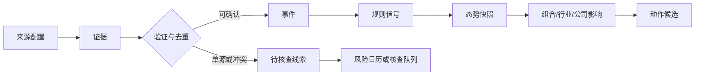

# 交易态势感知设计方案

> 状态：长期架构实施中；版本：0.2；日期：2026-08-01
>
> 目标：把宏观、市场、新闻/公告和个人组合中的变化，转成**可核查的交易动作候选**，辅助建立仓位、加仓、减仓、退出和再平衡；系统不自动下单，也不把未经验证的消息伪装成事实。

## 1. 要解决的问题

用户每天真正需要的不是更多资讯，而是按优先级回答三件事：

1. **市场正在交易什么**：发生了哪些可能影响股市的事件，价格和资金是否已经确认这条叙事；
2. **我的组合受什么影响**：哪些持仓的投资逻辑、估值、行业环境、集中度或风险预算发生了变化；
3. **有哪些值得研究或执行的机会**：哪些行业/公司同时出现催化、基本面、价格确认和可接受风险，而不是仅仅新闻热度很高。

产物是一个按紧急程度排序的“今日动作队列”，而不是一个给出单一涨跌预测的看板。

### 1.1 成功标准

- 每条动作候选都能回答：**为什么是现在、影响谁、建议做什么、什么条件下执行、何时失效、依据是什么**；
- 每个结论都能回溯到原始数据/新闻/公告、时间、来源等级、计算规则版本和当时个人组合；
- 新闻可以高时效地发现线索，但仅在满足规则后进入确定性信号；
- “没有足够证据”“未配置个人约束”“来源失败”均是正常、可见的输出；
- 回看任一历史日时，只使用当时可见的证据和个人配置，不用之后的修订或新闻补写历史结论。

### 1.2 非目标

- 不自动发送订单、不绕开账户权限，也不替代用户的最终判断；
- 不用大模型或单篇新闻直接生成交易结论、仓位比例或行情事实；
- 不把宏观总分当作买卖某只股票的充分条件；
- 不为追求覆盖率而接入不可稳定获取、授权不清或无法保存证据的来源。

## 2. 产品形态

入口命名为“态势感知”。首页以动作优先组织，二级页面用于核查与研究。

```text
今日动作队列
  ├─ 紧急处理：逻辑证伪、治理/流动性风险、集中度越线
  ├─ 计划执行：已满足的建仓、加仓、减仓、调仓条件
  ├─ 需要核查：持仓相关事件、单源新闻、即将发布的重要数据
  └─ 机会研究：行业/公司候选及其验证进度

市场正在交易什么 → 行业与公司传导 → 我的持仓/机会池 → 动作候选
```

### 2.1 首页：今日交易态势

首屏只展示本日真正需要处理的条目：

| 区域 | 内容 | 交互 |
| --- | --- | --- |
| 当前态势 | 市场状态、主要正在交易的主线、证据覆盖和数据健康 | 查看市场/行业传导 |
| 今日变化 | 相对上一快照新出现、升级、降级或失效的事件与信号 | 查看前后差异与证据 |
| 今日动作队列 | 紧急、计划执行、需核查、机会研究四类候选 | 确认、忽略、延后、进入交易记录 |
| 未来风险 | 未来 7 天重要日历、持仓公告窗口、规则临界点 | 设置关注或查看影响范围 |

没有满足条件的动作时，页面明确显示“今日无计划性交易动作”，不以低质量资讯填充。

### 2.2 我的持仓

每只持仓展示其“持仓档案”和最新影响：

- 当前仓位、成本、目标仓位、所属资金池、行业/主题和共同风险因子；
- 买入逻辑、关键验证指标、价值区间、2--4 项证伪条件及下一次检查日；
- 公司事件、行业事件、宏观/市场传导、相对强弱和估值变化；
- 产生的动作候选及其前置条件、最大可执行仓位、失效条件；
- 当时证据、历史态势快照和用户对上一条候选的处理结果。

### 2.3 机会池

机会池分为“行业机会”和“公司机会”，每项由以下四层组成：

1. **催化**：政策、供需、产品、订单、业绩、行业或地缘事件；
2. **基本面验证**：盈利预期、经营数据、行业景气是否改善；
3. **市场确认**：相对强弱、成交、波动和价格结构是否支持该叙事；
4. **估值与风险**：预期是否已透支、与现有组合的相关暴露、反证与失效条件。

机会卡只给出“观察”“进入研究”“建仓候选”或“暂不交易”，并说明还缺哪项证据；“建仓候选”不等同于立即买入。

### 2.4 证据与复盘

用户可以从每张卡片下钻到：原文/原始数值、来源、发布时间、抓取时间、抽取字段、关联实体、证据等级、规则版本及历史快照。复盘页将候选动作、用户实际处理、后续验证和规则表现并列，避免只看盈亏而无法发现错误来源。

## 3. 领域模型与状态边界

下列术语是本功能的唯一含义，避免“新闻”“信号”“机会”“建议”混用。

| 名称 | 定义 | 不能当作什么 |
| --- | --- | --- |
| 来源 Source | 可配置的数据提供者或采集方式，例如官方 API、东方财富、周期搜索、人工导入 | 一条新闻或一个结论 |
| 证据 Evidence | 可定位的原始内容或数值，保存 URL、时间、正文摘录/数值、抓取结果与哈希 | 交易建议 |
| 事件 Event | 多条证据归并后得到的、带时间与实体的“发生了什么” | 已被市场确认的交易主线 |
| 信号 Signal | 有版本化规则的可重复计算变化，例如行业相对强弱转正、实际利率压力上升 | 预测或因果证明 |
| 态势 Situation | 在某时点，对市场、行业或组合的可解释状态及证据覆盖 | 单一分数或确定性方向 |
| 影响 Impact | 事件/信号沿行业、公司、宏观因子传导到一个目标的关系 | 已实现盈亏 |
| 动作候选 Action Candidate | 满足个人规则后提出的建仓、加仓、减仓、退出、调仓或核查建议 | 自动订单或无条件指令 |

证据、事件、信号和动作候选必须是单向派生关系：



### 3.1 证据等级与事件状态

| 等级/状态 | 条件 | 能否进入核心评分 |
| --- | --- | --- |
| `official_confirmed` | 官方原文、交易所公告或可验证的原始数值 | 可以，按指标/规则配置 |
| `multi_source_confirmed` | 至少两个独立可信来源一致，且无冲突 | 可进入事件影响评分，不替代官方数值 |
| `single_source_lead` | 单一来源、正文不完整或时间/实体不能确认 | 仅提示核查 |
| `conflicting` | 关键事实相互冲突 | 不进入评分，提示冲突 |
| `stale` / `unavailable` | 超过时效或来源无法稳定获取 | 不进入评分，显示数据健康 |

新闻搜索首先生成 `single_source_lead`；提取到官方原文或满足多源验证后才升级。转发、改写和同源转载不得被计为“多源”。

## 4. 数据获取与可得性策略

本系统承认“直接接口不可得”是常态。来源配置必须支持多种采集方式，但不能因一个来源失败而虚构数据。

| 数据类别 | 首选方式 | 备选方式 | 使用边界 |
| --- | --- | --- |
| K 线、价格、成交和指数 | 东方财富适配器与缓存 | 无 K 线备用源 | 项目约束：所有 K 线只用东方财富 |
| 有稳定契约的宏观序列 | 官方 API / 官方公开文件 | 官方镜像或本地采集 | 保留发布期、修订与 freshness |
| 政策、产业、地缘和公司事件 | 周期搜索、正文抓取、官方链接回溯 | 人工导入 | 先进入线索层，按证据等级升级 |
| 公司公告、财报、业绩预告、研报 | 已有公司/财务/知识采集路径 | 本地浏览器采集后导入 | 公告优于新闻解读；大文件在本地加工 |
| 个人仓位、成本与交易计划 | 用户本地配置，后续受控持久化 | 手工导入 | 缺少配置时不能计算建议仓位 |

### 4.1 来源注册表

每个来源在配置中声明，而非在业务代码硬编码关键词或限流策略：

```text
source_id, name, kind, acquisition_method, enabled
topic_profiles, query_templates, allowed_domains, cadence
max_age, rate_limit, cache_ttl, evidence_policy, license_notes
last_success, last_error, health_state
```

其中 `acquisition_method` 为 `structured_api`、`scheduled_search`、`document_fetch`、`local_browser_import` 或 `manual_import`。任何 `scheduled_search` 都必须记录检索词、结果 URL、抓取时间和正文获取结果，不能只保存模型摘要。

### 4.2 采集调度与运行位置

根据现有数据获取策略选择运行位置：

- Worker Cron：稳定、低成本、适合按观察范围增量刷新来源；
- 用户请求路径：只读本地/D1 缓存，最多触发轻量的按需补齐；
- Mac 本地任务：需要真实浏览器、Cookie、复杂反爬、PDF/长文处理或耗时 LLM 加工的来源；
- 远端 API：只读取已规范化的 D1/R2 数据，不在首屏同步等待新闻搜索或长文抽取。

每次任务要保存任务水位、成功/失败、抓取量、去重量、解析失败和来源健康。对于新闻源，按“持仓 + 机会池 + 已关注行业 + 已配置主题”限定搜索范围，禁止无边界扫全网。

## 5. 从资讯到交易候选的规则

### 5.1 市场态势：背景，不是买卖开关

宏观模块现有的增长、通胀、流动性、信用、外部风险及四市场传导继续作为背景层。市场态势必须同时包含：

- 结构化硬信号及其 freshness、修订和缺失；
- 事件主线及证据状态；
- 市场确认：相关指数/行业相对强弱、成交和波动；
- 不确定性：覆盖率、冲突与即将发布的验证事件。

宏观压力只能改变机会和仓位的优先级，不能绕过个股基本面、估值、安全边际和集中度规则直接发出卖出指令。

### 5.2 持仓动作候选

动作产生顺序固定，低优先级不得覆盖高优先级：

1. **紧急退出/逻辑证伪**；
2. **集中度和组合回撤复核**；
3. **持仓逻辑、价值与行业环境复核**；
4. **计划内建仓、加仓、减仓或资产桶轮动**；
5. **新闻线索或价格异动带来的核查任务**。

| 动作 | 必要条件 | 系统输出 |
| --- | --- | --- |
| 建仓 | 已完成研究；基本面/催化与价格或估值条件满足；现金、市场和集中度检查通过 | 分批计划、最大首笔、待验证点与失效条件 |
| 加仓 | 核心逻辑未被否定或更强；估值更有吸引力；组合风险和主动上限通过 | 剩余可加仓空间及不加仓原因 |
| 减仓 | 价值明显透支、催化兑现后风险收益下降、行业/组合风险上升或仓位越线 | 目标仓位、优先卖出理由、复核节点 |
| 退出 | 证伪、治理/财务可信度破坏、流动性/偿债危机等规则触发 | 紧急程度、原始证据和执行例外 |
| 调仓 | 资产桶/行业/赛道/共同因子偏离用户规则，且替代标的风险收益更优 | 交易前后暴露、资金来源和税费/流动性检查 |
| 核查 | 只有单源线索、市场未确认或个人档案缺失 | 所需证据、截止时间和不交易默认值 |

任何候选都不得把“股价下跌”“摊低成本”“新闻热度”单独作为加仓条件。这与现行个人交易规则一致。

### 5.3 行业与公司机会

行业机会先形成“主题假设”，再关联到公司，不允许从一篇新闻直接生成股票推荐：

```text
事件/数据变化
  → 行业假设（受益、受损、分歧）
  → 行业确认（景气、盈利、相对强弱、成交）
  → 公司筛选（业务暴露、财务、估值、治理、流动性）
  → 个人组合约束检查
  → 观察 / 研究 / 建仓候选 / 暂不交易
```

公司机会卡需展示：催化、基本面、市场确认、估值/预期、关联持仓或相关暴露、反证、下次验证时间，以及当前不能交易的原因。公司与行业、主题、宏观因子的映射应配置化且可审核。

## 6. 个人约束与建议仓位

“加多少、减多少、调到哪里”只能由用户已配置的规则决定。系统需要接入或逐步补齐以下字段：

```text
holding: code, account_pool, quantity/value, cost, target_weight, max_weight
thesis: investment_case, horizon, drivers, verification_metrics, invalidations
valuation: conservative_value_range, entry_ranges, trim_range
exposure: company, industry, track, theme, macro_factor
portfolio_policy: cash_floor, sector/track/company caps, drawdown gates, trade timing
```

当前项目已具备浏览器侧关注列表以及部分仓位、成本、跟踪字段；它们适合作为第一版个人视图输入。组合交易候选与确认接口目前是未迁移占位，因此在具备受控持久化模型前，只生成本机可见的候选和交易记录草稿，不声称已经实现跨设备、线上账户级组合管理。

本地持仓档案的最小可执行字段为 `currentWeight`、`targetWeight`、`maxWeight`、`thesisIntact`、`researchComplete`、`fundamentalsConfirmed`、`marketConfirmed`、`valuationEntryReady`、`valuationAddReady`、`valuationTrimReady` 与 `invalidations`。所有权重使用 0--1 小数。只有这些字段和组合中的 `cashWeight`/集中度阈值明确提供后，规则引擎才会生成建仓、加仓、减仓、退出或再平衡候选；缺少任一前提时保持“核查/不交易”。

个人规则来源以 `docs/personal-trading-rules.md` 为准：单股、赛道、行业上限；两个资金池；分批建仓；加仓三条件；逻辑证伪优先；以及回撤/计划交易纪律。态势功能只能执行和提示这些约束，不能改变它们。

## 7. 存储、接口与快照

在现有宏观表之外，新增独立的态势感知存储。原始大型内容仍放 R2，D1 保存索引、结构化抽取、关联关系和快照。

```text
situation_sources
  source_id, config_json, health_state, last_success_at, last_error, updated_at

situation_evidence
  evidence_id, source_id, external_id, url, title, published_at, fetched_at,
  content_hash, raw_r2_key, extracted_json, evidence_grade, status

situation_events
  event_id, canonical_key, title, occurred_at, region, event_type,
  status, importance, summary, first_seen_at, last_seen_at

situation_event_evidence
  event_id, evidence_id, role, confidence, created_at

situation_signals
  signal_id, subject_type, subject_id, rule_version, state, score,
  confidence, observed_at, input_json, explanation_json

situation_snapshots
  snapshot_id, as_of, scope_type, scope_id, state, confidence,
  summary_json, rule_version, created_at

situation_impacts
  impact_id, event_id_or_signal_id, target_type, target_id, direction,
  transmission, confidence, rationale_json, expires_at

situation_action_candidates
  candidate_id, as_of, action_type, target_type, target_id, priority,
  status, prerequisites_json, proposed_plan_json, invalidations_json,
  evidence_json, rule_version, user_disposition, created_at, resolved_at
```

建议 API：

- `GET /api/situations/today`：当前态势、变化和动作队列；
- `GET /api/situations/markets`、`/industries`、`/holdings`、`/opportunities`：各视图及筛选；
- `GET /api/situations/evidence/:id`、`/events/:id`、`/snapshots/:id`：证据与历史下钻；
- `POST /api/situations/candidates/:id/disposition`：用户标记确认/忽略/延后/需研究，仅记录，不下单；
- `POST /api/situations/sync`：本地开发诊断入口；生产由受控 Cron/本地采集导入执行。

所有历史查询需要 `asOf` 语义：返回该时点已入库、当时可见且未过期的证据与规则版本。

## 8. 规则配置与模型职责

规则分为三类，均必须配置化、版本化：

1. **来源与主题规则**：检索词、白名单域名、时效、采集频率、去重和证据升级条件；
2. **传导规则**：事件类型 → 宏观因子/行业/公司暴露，方向、权重和过期时间；
3. **个人交易规则**：持仓上限、估值区间、建仓/加仓/减仓条件、回撤闸门和交易时段。

LLM只能完成受约束的抽取、归类、摘要和候选理由撰写；必须输出引用的 `evidence_id`，不能填补数值、来源、公司暴露或交易条件。规则引擎负责确定等级、暴露、约束是否满足及动作优先级。

## 9. 分期落地

### Phase 0：规则与数据地基

- 新建来源注册、证据、事件、快照和动作候选模型；
- 定义主题/行业/公司/因子映射配置与证据等级；
- 打通现有宏观信号、东方财富行情、关注列表和公司事件的只读输入；
- 建立数据健康、去重、任务水位和失败可见性；
- 不产生买卖数量，只产生核查与观察候选。

**验收**：任一态势卡能追溯原始证据；重复新闻不会生成重复事件；来源失败不会让旧数据冒充新数据。

### Phase 1：今日态势与持仓影响

- 首页“当前态势、今日变化、未来风险、今日动作队列”；
- 把已关注/已配置仓位的公司映射到行业、事件和宏观传导；
- 实现紧急退出、集中度复核、核查任务和计划性动作候选；
- 保存日度/事件驱动快照及用户处置结果。

**验收**：一次持仓相关公告或宏观状态变化能显示影响链、证据等级、待做事项和失效条件；没有个人仓位配置时不显示虚假的仓位建议。

### Phase 2：周期新闻发现与机会池

- 增加来源适配器，支持周期搜索、正文抓取、实体识别、聚类和官方原文回溯；
- 形成行业假设、验证进度和公司候选；
- 接入“研究/观察/建仓候选/暂不交易”的机会漏斗；
- 对新闻源使用按主题和观察范围的限量采集，不在访问路径抓取。

**验收**：单源新闻只进入核查队列；独立来源或官方原文补齐后可升级；机会卡能指出缺失验证和组合冲突。

### Phase 3：个人组合与复盘

- 迁移受控的组合、交易计划和候选处置存储；
- 计算公司/行业/主题/宏观因子集中度，以及资产桶和回撤闸门；
- 建立动作候选的点时回放、执行偏差和结果归因；
- 基于足够样本评估规则，不以单次盈亏修改规则。

**验收**：可重放某日的“当时为何建议、用户如何处理、后续证据如何变化”；回测和复盘不会读取未来修订或未来新闻。

## 10. 风险控制与度量

### 10.1 防错机制

- 来源 unavailable、字段解析失败、时钟异常、内容重复、实体不确定和证据冲突均可见；
- 每个动作候选显示置信度和阻塞条件，低证据候选默认是“核查”，不是“执行”；
- 设置有效期：事件、信号和动作候选过期后自动降级，不持续骚扰用户；
- 通知仅在状态切换、优先级升级或接近关键验证时间时发送；
- 用户“忽略”的原因要可记录，用于改进规则而不被模型自行重写。

### 10.2 评价指标

先衡量流程质量，再评估交易价值：

| 指标 | 含义 |
| --- | --- |
| 证据覆盖率 | 产生动作候选中，拥有可访问原始证据的比例 |
| 重复/误聚类率 | 同一事件被重复推送或不相关事件被错误合并的比例 |
| 时效 | 事件发布时间到可见候选的延迟，以及数据 freshness |
| 有效提醒率 | 用户标记为需要处理/研究的候选占比 |
| 规则遵守率 | 执行交易是否通过既有集中度、价值和证伪检查 |
| 点时验证 | 历史重放时使用的证据与规则是否完全属于当时可见集合 |

收益、胜率和回撤只在有足够样本、交易成本和未执行候选都被完整记录后评估；不能用事后选出的成功案例证明系统有效。

## 11. 已落地范围与待决事项

当前实现已建立长期架构的可运行骨架，而不是把首页当作一次性原型：

- D1 已保存来源、去重证据、事件/证据关系、规则信号、点时快照、影响、持仓档案、组合规则、动作候选与追加式处置记录；
- 每 10 分钟重算已入库证据和个人候选，并将既有宏观 vintage 按 `asOf` 生成市场/行业信号、影响和快照；缺失或过期因子只降低置信度，不会伪造方向；
- 现有四个页面提供今日态势、持仓影响、机会池和证据/快照下钻；所有候选仍是“核查/研究/执行前提”，不自动下单；
- 通用 Evidence 导入契约已可供新闻、周期搜索、官方公告或人工导入适配器调用。新闻接入必须先写证据，再按等级归并事件，不能跳过这一层写动作候选；
- 知识处理中的主题过滤已改为分流：选中的内容进入 `knowledge_docs`，低相关内容保留在 `knowledge_filtered_docs`，两者均会按幂等水位周期转为 `single_source_lead` Evidence；缺少原始 URL 的内容保留在知识库并显式记录为不可追溯，不能伪造来源进入 Evidence；
- 生产写入暂不开放：在登录态 owner、加密组合存储和权限边界完成前，持仓档案、规则、证据导入和候选处置仅允许本地开发环境写入。

仍需要按长期路线继续连接的输入，不以模拟数据替代：新闻/公告来源适配器与 R2 原文归档、持仓档案编辑与受控登录存储、东方财富价格/估值确认、以及基于已结构化个人规则的建仓/加减仓/退出/调仓计算。

知识采集和 PDF 转 Markdown 默认不在本机常驻调度器中自动运行，避免后台批处理占用 CPU；需要更新时通过显式知识处理命令手动触发。Worker 的态势 Cron（每 10 分钟）只处理已入库 Evidence。外部抓取需要真实浏览器、Cookie 或许可时，仍应留在本机任务，不放进 Worker 请求路径。

已可复用的能力：宏观雷达的信号/来源健康/vintage/无前视研究、东方财富 K 线与公司数据、关注列表、公司跟踪及本地知识加工路径。

需要在开始 Phase 0 时明确的产品决策：

1. 个人仓位和交易计划的持久化边界：只保留本机，还是引入登录后的加密账户级存储；
2. 哪些新闻来源具有允许的采集/使用方式、刷新频率与保存期限；
3. 第一批主题档案和公司/行业映射的维护责任；
4. 是否保留交易仓；若保留，须与投资仓使用不同的触发、止损和最长持有期规则；
5. 通知渠道和用户确认流程：初期只站内/本机展示，未经授权不外发消息。

在上述决策未完成前，可以交付态势、证据、核查和研究能力；不能把它描述为完整的自动化投资顾问或自动交易系统。
