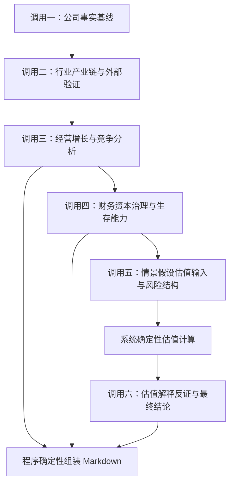

# 公司投资分析大模型分阶段调用规范

> 状态：后续落地遵循的设计规范  
> 日期：2026-08-09  
> 依据：[`公司经营与行业产业分析框架_修订版.md`](./公司经营与行业产业分析框架_修订版.md) 与[当前正在使用的“投资分析”Prompt](../prompts/research/operating-analysis.md)  
> 适用范围：使用大模型对一家公司的经营、行业、产业链和证券价值进行完整分析

## 1. 文档目的

本规范用于约束“投资分析”功能后续的提示词拆分、任务编排、输入准备、检索范围、阶段输出和最终报告。目标不是把现有长 Prompt 简单拆成若干短 Prompt，而是建立一条能够区分证据、判断、预测和估值，并能适配不同行业经济模型的完整研究链路。

后续实现必须遵循以下产品形态：

> 用户发起一次完整投资分析任务，系统内部执行六次有明确依赖关系的大模型调用，再由程序确定性组装为一份完整 Markdown 报告。

“一次任务”和“一次模型调用”不是同一个概念；“一份最终报告”也不意味着所有工作必须在一个 Prompt 中完成。

## 2. 整体分析目标

完整分析必须把公司视为一套经济系统，而不是只解释一个股票代码。最终需要贯通以下因果链：

```text
终端需求
→ 产业链订单与供需
→ 公司销量或用户量
→ 价格与市场份额
→ 收入与利润率
→ 资本投入与营运资本
→ 自由现金流
→ 每股价值
→ 当前市场价格隐含的经营要求
```

最终报告至少必须回答：

1. 公司卖什么、解决什么问题、谁是用户、采购者和付款者；
2. 行业需求如何形成，供给如何扩张，产业链利润主要流向哪里；
3. 公司相对竞争者的优势和劣势是什么，优势能够持续多久；
4. 增长来自销量、价格、产品结构、市场份额、新产品、并购还是汇率；
5. 会计利润能否转化为经营现金流和自由现金流；
6. 增长需要投入多少资本，增量资本回报是否高于资本成本；
7. 资产负债表能否承受需求下降、价格下跌、回款放慢和融资收紧；
8. 管理层、治理、激励和资本配置是否持续提高每股价值；
9. 当前价格隐含了怎样的增长、利润率、资本回报和竞争优势持续期；
10. 哪些领先指标、反面证据和验证阈值能够持续证实或推翻上述判断。

本功能不以自动生成买卖建议为目标。报告的核心产物是可核验的经营结论、显式预测假设、估值边界、反面证据和后续验证方法。

## 3. 核心领域边界

### 3.1 公司质量与证券价值分开

公司经营质量回答公司作为经济实体是否优秀；证券价值回答某一价格对应的投资要求是否合理。二者必须先后分析，不能因为公司优秀就直接推出股票便宜，也不能因为估值较低就直接推出公司质量良好。

### 3.2 九类认识对象必须分开

| 标签 | 含义 | 允许来源或形成方式 |
|---|---|---|
| `[系统结构化数据]` | 系统通过已接入接口或缓存取得并完成字段、期间、单位和币种规范化的数据 | 三张财务报表、市场快照以及基于这些数据确定性计算的指标 |
| `[正式披露]` | 公司或监管机构已经正式披露的事实 | 法定报告、公告、监管文件、审计和内控文件 |
| `[管理层表述]` | 管理层的解释、计划、目标或指引 | 电话会、业绩说明会、IR 记录、演示材料、公开采访 |
| `[外部证据]` | 独立于目标公司的行业或交叉验证资料 | 政府、监管、行业协会、客户、供应商、同行和其他可回链原文 |
| `[第三方预测]` | 有明确预测主体、发布时间、预测期间和口径的外部前瞻判断 | 卖方、行业研究机构、客户、供应商或同行公开发布的预测原文 |
| `[分析判断]` | 根据已编号证据形成的经营解释或因果判断 | 只能引用前序证据，不得创造新事实 |
| `[预测假设]` | 对未来量、价、份额、利润率、资本投入等变量的显式假设 | 必须说明依据、适用期间、上下界和不确定性 |
| `[估值结果]` | 将预测假设通过明确公式转换得到的价值或隐含要求 | 必须关联估值方法、公式、输入、每股桥接和敏感性 |
| `[未知项]` | 现有证据不足、冲突或口径不可比的问题 | 不得猜测、补齐或悄悄忽略 |

任何阶段都不得把管理层目标写成已实现事实，不得把第三方预测写成公司指引，不得把分析判断写成外部事实，也不得把业绩预告或快报写成正式财报。

### 3.3 模型分析与文档组装分开

不再设置“让模型把全部上游内容重新改写一遍”的最终合并调用。不同阶段按照其认知任务输出 JSON 或最终章节级 Markdown，程序按照固定目录确定性组装最终报告：

- 调用一、二负责证据提取，输出 JSON；
- 调用三、四负责长篇因果分析，直接输出最终报告可用的 Markdown 章节；
- 调用五负责情景、估值输入和风险结构化，输出 JSON；
- 系统根据调用五的输入执行可复算的确定性估值；
- 调用六只解释估值结果、完成反证、跟踪仪表盘和最终结论，输出最终报告可用的 Markdown 章节；
- 程序生成研究范围与事实边界，并将调用三、四、六的 Markdown 按固定顺序拼装，不再让模型二次摘要或改写。

## 4. 总体调用流程



依赖规则：

- 调用二必须使用调用一确认的主营业务、产品、客户和地区边界；
- 调用三只能使用调用一、二形成的证据；
- 调用四必须使用系统结构化三张报表检验调用三的经营判断；
- 调用五必须使用调用三、四形成的经营和财务结论构建情景假设、估值输入和风险结构；
- 确定性估值程序只能消费调用五已经确认的输入，不得自行生成经营假设；
- 调用六只能解释确定性估值结果并完成反证、监测和最终结论，不得重写调用三、四的章节；
- 最终报告由程序组装，不能在组装阶段增加或删除实质结论。

## 5. Prompt 输入与模型输出格式

### 5.1 Prompt 不应整体写成 JSON

Prompt 应采用“自然语言或 Markdown 指令 + JSON 数据区”的混合结构：

```text
任务目标、来源边界、禁止事项、分析步骤、输出要求

<input_data>
{结构化 JSON 数据}
</input_data>
```

原因不是为了方便程序解析，而是为了让模型在两类信息上分别发挥优势：

- 自然语言或 Markdown 更适合表达研究目标、证据规则、行业差异、因果要求和禁止事项；
- JSON 更适合承载公司身份、报告期、三张报表、市场快照、证据记录、上游结论和稳定 ID，能够减少字段歧义；
- 如果把整个 Prompt 包成 JSON，大量转义、层级和语法约束会占用模型注意力，也不利于理解复杂研究任务；
- JSON 数据区必须有明确字段语义、期间、单位、币种和 `null` 规则，不能把未经整理的巨大原始响应直接塞入 Prompt。

### 5.2 输出格式按认知任务选择

从模型完成任务的能力出发，不统一强制所有阶段输出一种格式：

| 调用 | 任务性质 | 输出格式 | 选择原因 |
|---|---|---|---|
| 调用一 | 有边界的事实和来源提取 | JSON | 对象离散、字段明确，模型更容易保持事实类别和来源对应关系 |
| 调用二 | 有边界的行业证据和同行提取 | JSON | 需要保存口径、来源、冲突和可比性，结构化输出更不容易混淆 |
| 调用三 | 商业模式、行业传导、增长和竞争因果分析 | Markdown | 长篇因果论证、反面证据和限制在自然语言中更完整，强制深层 JSON 容易碎片化判断 |
| 调用四 | 财务质量、资本效率、治理和压力分析 | Markdown | 需要跨报表解释和逐项验证经营命题，Markdown 更适合连续推理与表格并用 |
| 调用五 | 三情景假设、估值输入、风险和监测字段 | JSON | 假设和数值输入必须精确、可复算，不能埋在散文中 |
| 调用六 | 估值解释、反证、跟踪仪表盘和最终结论 | Markdown | 需要综合解释已经算出的结果，但不再承担全报告改写 |

JSON 只适合边界清楚、字段有限的提取或假设任务。对于长篇综合分析，强制输出巨大嵌套 JSON 会增加漏字段、截断、转义错误和结论碎片化的概率；Markdown 更符合模型生成复杂研究论证的能力。

### 5.3 所有调用共享的输入信封

每次调用都应接收同一研究任务的基础元数据，避免不同阶段使用不同公司、日期或证券口径：

```json
{
  "researchTaskId": "任务唯一标识",
  "asOf": "研究截止时间",
  "company": {
    "name": "经营公司名称",
    "reportingCurrency": "财报币种"
  },
  "security": {
    "securityCode": "证券代码",
    "listingVenue": "上市地",
    "tradingCurrency": "交易币种"
  },
  "reportingBoundary": {
    "latestFiledPeriod": "最新正式财报期",
    "latestAnnualPeriod": "最近年度报告期",
    "laterProvisionalUpdates": []
  },
  "marketSnapshot": {
    "asOf": "市场快照日期",
    "price": null,
    "marketCapitalization": null,
    "currency": null,
    "reportedMultiples": {}
  },
  "financialDataSnapshot": {
    "asOf": "结构化财务数据截止时间",
    "schemaVersion": "财务数据契约版本",
    "source": "接口或缓存来源",
    "periods": [],
    "incomeStatement": [],
    "balanceSheet": [],
    "cashFlowStatement": [],
    "deterministicMetrics": [],
    "qualityIssues": []
  },
  "industryProfile": null,
  "upstreamArtifactRefs": []
}
```

共同规则：

- 所有时间敏感结论必须受 `asOf` 约束；
- 正式财报、业绩预告、业绩快报和管理层指引必须分别保存；
- 三张报表数值只使用系统已经接入的结构化接口或缓存，不要求大模型搜索、抄录或重新抽取；
- 同比、利润率、现金流转换率、自由现金流、营运资本变化等可以确定性计算的指标应由系统先计算，再交给模型解释；
- 结构化财务数据必须保留来源、截止时间、报告期、单位、币种和质量问题；
- 市场快照只用于证券定价，不得反向当作公司经营事实；
- 上游产物必须通过稳定 ID 引用，不能把无法追溯来源的摘要继续传递；
- 每次调用都必须输出其实际使用的上游产物 ID 和证据 ID。

## 6. 行业差异适配机制

### 6.1 行业配置先于分析

调用一必须先根据公司正式披露识别主营业务和重要分部，并生成行业配置候选；调用二再用独立证据校验。行业配置至少包含：

```json
{
  "profileId": "行业或商业模式标识",
  "businessScope": "产品、客户、地区和用途边界",
  "quantityVariable": "行业的量",
  "priceVariable": "行业的价",
  "unitCostDrivers": [],
  "capitalDrivers": [],
  "industryStage": "导入期|高增长期|成熟期|周期上行|周期下行|衰退或替代|未知",
  "requiredMetrics": [],
  "leadingIndicators": [],
  "preferredValuationMethods": [],
  "invalidOrMisleadingMethods": [],
  "requiredStressScenarios": []
}
```

如果行业配置无法确认，应输出 `[未知项]`，不得默认套用制造业、互联网或其他通用模板。

### 6.2 多业务公司

对于跨行业或多业务公司：

1. 按可识别的重要业务分部建立多个行业配置；
2. 分别分析各分部的量、价、成本、资本和周期；
3. 只有在业务边界和财务数据可分时才进行分部估值；
4. 无法合理拆分的分部必须说明限制；
5. 不得为了得到目标价而对所有分部套用同一个倍数。

### 6.3 行业研究与估值适配表

| 行业或商业模式 | 必须识别的经营模型和指标 | 优先估值方法 | 必须避免的简化 |
|---|---|---|---|
| 半导体设计 | 出货量、ASP、产品代际、设计中标、客户导入、晶圆和封装约束、渠道库存、研发、客户集中度 | DCF、PE、EV/EBIT | 把设计中标当收入；永久外推供给紧张期毛利率 |
| 晶圆代工 | 晶圆出货、利用率、节点结构、ASP、良率、折旧、新厂爬坡、资本开支 | DCF、EV/EBITDA、资产价值 | 忽略高固定成本、折旧和扩产资本需求 |
| 存储芯片 | bit 出货、ASP、单位 bit 成本、库存、利用率、节点迁移、HBM 占比、竞争者扩产纪律 | 中周期利润、DCF、资产价值 | 使用周期顶部利润和表面低 PE |
| 半导体设备与光通信设备 | 新签和在手订单、book-to-bill、取消率、交付、认证、客户资本开支、份额、应收和存货 | DCF、PE、EV/EBIT | 把订单、认证或行业扩产直接当作确定收入 |
| 软件与 SaaS | ARR、NRR、GRR、客户数、每客户收入、RPO、CAC 回收期、销售效率、FCF 率、股权稀释、AI 计算成本 | DCF、EV/收入、EV/FCF、PE | 只比较收入倍数；忽略留存、长期利润率和股数增长 |
| 互联网平台、电商与广告 | 用户、频率、GMV、订单、客单价、广告量价、抽佣率、补贴、履约成本、单位贡献利润、网络效应 | DCF、分部估值、PE | 把 GMV、流量或用户数直接等同于公司价值 |
| 消费品牌 | 销量、提价、结构、份额、终端动销、渠道库存、复购、促销、营销效率、原材料 | DCF、PE、EV/EBIT | 混淆公司向渠道发货与终端真实销售 |
| 零售 | 同店销售、客流、客单价、门店数、坪效、成熟周期、库存周转、新店回收期、租赁负债 | DCF、PE、EV/EBIT | 把开店带来的总收入增长当成老店经营改善 |
| 工业制造、自动化与机械 | 新订单、在手订单、book-to-bill、取消、交付、利用率、原材料、应收、存货、预收、下游资本开支 | DCF、PE、EV/EBIT | 将景气高点的订单、利用率和利润率长期外推 |
| 资源、能源与化工 | 产量、产品价格、单位现金成本、成本曲线、库存、储量寿命、维持性资本开支、对冲、环保义务 | 中周期利润、DCF、资产价值 | 周期顶部用 PE；把储量等同于可实现价值 |
| 银行 | 净息差、存款成本和结构、贷款增长、不良和关注类贷款、拨备、信用成本、核心一级资本、ROE、每股净资产 | P/B、PE、股利折现、剩余收益 | 使用普通企业净负债和 EV/EBITDA；只因低 P/B 判定便宜 |
| 财险 | 保费、赔付率、费用率、综合成本率、准备金、巨灾和再保险、投资收益、偿付能力 | P/B、剩余收益、适用的股利或内含价值方法 | 只看保费和利润增长，忽略准备金和承保质量 |
| 寿险 | 新业务价值和价值率、继续率、退保率、产品结构、代理人产能、利差费差死差、久期匹配、偿付能力 | P/B、内含价值、剩余收益 | 使用乐观投资收益率；忽略负债成本和久期错配 |
| 成熟制药 | 核心产品收入、适应症、渗透率、专利到期、仿制竞争、医保支付、管线质量、研发和销售费用 | DCF、PE、分部或产品估值 | 只看当前低 PE，忽略专利悬崖和收入缺口 |
| 未盈利生物科技 | 现金消耗、现金跑道、临床阶段和终点、入组、安全性、监管沟通、竞争管线、融资与稀释 | 概率调整 NPV、净现金 | 使用 PE；忽略临床失败概率、后续投入和融资稀释 |
| 汽车与新能源汽车 | 销量、ASP、促销、单车毛利和贡献利润、车型周期、订单交付、库存、利用率、电池成本、资本开支、汽车金融 | DCF、PE、EV/EBIT；多业务时分部估值 | 把降价换来的销量和份额增长当成价值增长 |
| REITs | 出租率、租金增长、同店 NOI、新签租金差、租约到期、FFO、AFFO、分红覆盖、资本化率、NAV、债务到期 | NAV、FFO、AFFO、股利折现 | 只看会计净利润；把 FFO 直接当自由现金流 |
| 房地产开发 | 销售和回款、土地储备、拿地成本、项目毛利、监管资金、净负债、短债、交付和存货减值 | NAV、现金流、资产清算价值 | 只看合同销售额或账面利润，忽略回款和债务 |
| 公用事业与基础设施 | 监管资产基数、允许回报、电价或水价机制、利用小时、燃料传导、资本开支、债务、利息覆盖和融资 | DCF、股利折现、P/B | 将建设期低 FCF 一概视为经营恶化 |
| 电信运营商 | 用户、ARPU、流失率、网络和频谱资本开支、竞争降价、净负债、FCF、分红覆盖、企业业务 | DCF、股利折现、PE | 只看收入稳定，忽略高资本开支和负债对每股价值的限制 |
| 工程、建筑和项目制 | 新签和有效在手订单、业主资信、合同类型、项目进度、转化率、合同资产、应收、回款、减值和索赔 | DCF、PE、EV/EBIT；必要时项目或分部估值 | 把在手订单当利润或现金；忽略完工百分比和回款风险 |
| 资产管理 | AUM、净流入、投资业绩、费率、产品结构、客户集中、市场上涨贡献、费用和表内投资风险 | DCF、PE、分部估值 | 混淆市场上涨带来的 AUM 增长与客户净申购 |
| 券商与交易平台 | 交易量、经纪费率、客户资产、融资融券、投行、自营、利息收入、资本充足率、客户留存和监管 | PE、P/B、剩余收益、分部估值 | 把牛市周期利润增长当成长期竞争力改善 |
| 多元集团 | 各分部独立的收入机制、现金流、资本强度、周期、净债务和总部成本 | SOTP | 对全部业务使用同一倍数或忽略总部折价和净债务 |

## 7. 调用一：公司事实基线

### 7.1 目标

建立截至研究截止日的公司事实底稿，回答“公司是什么、卖什么、如何赚钱、正式披露了什么”，并确定后续行业研究的真实业务边界。

### 7.2 输入

- 共享输入信封；
- 公司名称、证券代码和上市地；
- 最新正式财报期和最近年度报告期；
- 当前 Prompt 已有的报告期边界；
- 系统结构化财务数据的版本、期间覆盖和质量状态；
- 已取得但尚未作为事实使用的市场快照，仅用于身份核对，不用于经营结论。

### 7.3 检索范围

优先级从高到低：

1. 年报、半年报、季报中的业务说明及财务报表附注；
2. 交易所、监管机构和公司正式公告；
3. 审计报告、内部控制报告、问询函及回复；
4. 公司官网和投资者关系页面；
5. 电话会、业绩说明会、IR 记录、演示材料和管理层公开交流。

本次调用不得使用行业媒体、同行评论或第三方研报替代公司事实。搜索结果页只能用于发现原文，不能作为已验证事实来源。

本次调用不得搜索、抄录或重新抽取三张报表中的收入、利润、资产负债和现金流数值。三张报表及其可确定性计算的指标由系统结构化接口或缓存提供。大模型只检索结构化报表没有覆盖的业务解释、分部信息、会计政策、治理、债务条款、或有事项及其他定性披露。

### 7.4 必须提取的内容

- 公司身份、上市地、报告币种、报告期和会计口径；
- 产品、服务、业务分部、地区和客户结构；
- 用户、采购决策者和付款者；
- 定价、合同、销售渠道和收入确认方式；
- 一次性与经常性收入；
- “量、价、单位成本、固定成本和资本投入”的候选定义；
- 结构化财务数据未覆盖的业务分部、非标准经营指标和口径说明；
- 订单、产能、销量、客户集中度、研发和资本开支；
- 受限现金原因、债务条款、担保、诉讼、商誉形成与减值说明和潜在稀释事项；
- 管理层指引、承诺、资本配置和治理事项；
- 可能适用的行业配置及不能确认的边界。

### 7.5 输出

输出严格结构化 JSON，不输出完整研究报告。至少包含：

```json
{
  "scope": {},
  "businessBoundary": {},
  "industryProfileCandidates": [],
  "systemFinancialDataRef": {},
  "formalDisclosureFacts": [],
  "managementStatements": [],
  "reportingAndAccountingNotes": [],
  "governanceAndCapitalAllocationFacts": [],
  "unknowns": [],
  "sourceIndex": []
}
```

每条事实必须包含：事实 ID、标签、主体、陈述、适用期间、产品/地区/客户边界、币种和单位、来源标题、原文 URL、发布日期以及限制。

### 7.6 完成条件

- 公司身份和主要业务边界已经确认，或明确标记无法确认；
- 最新正式财报与后续预告、快报和管理层指引已分开；
- 每条通过检索取得的重要事实都有可点击原文；系统结构化财务数据使用其自身来源元数据，不要求模型另找网页链接；
- 没有用管理层目标填补实际结果；
- 没有重复搜索或重新抽取三张报表数值；
- 已生成后续行业检索所需的产品、客户、地区和用途边界。

## 8. 调用二：行业、产业链、同行与外部验证

### 8.1 目标

在调用一确认的业务边界内研究行业经济性、产业链利润池、供需、竞争和周期，并用独立资料验证或质疑公司的经营叙事。

### 8.2 输入

- 共享输入信封；
- 调用一的业务边界、行业配置候选和事实 ID；
- 调用一列出的公司主张、管理层表述和关键未知项。

### 8.3 检索范围

优先使用：

1. 政府、监管和官方统计；
2. 行业协会、标准组织和公开行业数据；
3. 客户、供应商和同行的法定披露；
4. 可回链的行业研究机构公开原文；
5. 权威媒体对供需、价格、产能、库存、监管和技术变化的原始报道。

目标公司自己的披露可以用于界定问题，但不能作为“独立外部验证”。市场空间、行业阶段、竞争、风险和监管变化若找不到独立原文，必须输出 `[未知项]`。

### 8.4 必须研究的内容

- 细分行业和可服务市场边界；
- 行业的量、价、单位成本和资本投入；
- 上游、中游、下游、终端用户和替代方案；
- 各环节的资本强度、议价权、库存责任和利润池；
- 供给、需求、库存、产能、利用率、价格和交付周期；
- 行业所处导入、高增长、成熟、周期上行、周期下行或替代阶段；
- 直接同行、替代品和同行可比性限制；
- 市场份额、技术路线、认证、标准和监管；
- 公司披露得到支持、补充或反驳的部分；
- 行业专属领先指标、压力情景和估值方法。

### 8.5 输出

```json
{
  "validatedIndustryProfile": {},
  "industryBoundary": {},
  "valueChain": [],
  "profitPool": [],
  "supplyDemandAndCycle": {},
  "peerSet": [],
  "externalEvidence": [],
  "thirdPartyForecasts": [],
  "supportsCompanyClaims": [],
  "contradictsCompanyClaims": [],
  "sourceConflicts": [],
  "unknowns": [],
  "sourceIndex": []
}
```

所有同行比较必须说明产品、地区、客户、期间、币种、会计和资本强度是否可比。不同口径的数据不得强行排名或相除。

### 8.6 完成条件

- 只有一个经过证据支持的主要行业配置，或明确保留多个分部配置；
- 行业量、价、成本、资本和领先指标已定义；
- 目标公司自述与独立外部证据已经分开；
- 行业与竞争的重要判断具备外部原文，缺失部分已明确列出；
- 估值方法和不适用方法已经确定。

## 9. 调用三：经营、增长与竞争优势分析

### 9.1 目标

把公司事实和行业事实连接成可证伪的经营因果链，形成对商业模式、竞争位置、增长来源和优势持续期的判断。

### 9.2 输入

- 调用一的公司事实、管理层表述和业务边界；
- 调用二的行业配置、产业链、同行、外部证据和冲突；
- 系统结构化财务数据中的历史增长、利润率、现金流和资本回报摘要，用于避免经营判断脱离已经存在的财务事实；
- 所有相关证据 ID 和未知项。

### 9.3 检索范围

默认不允许新的 Web Search。本次调用只能使用前两次已经入账的证据。若分析需要新的事实，应输出 `evidenceGap`，由任务回到调用一或二补充，而不是在本阶段临时搜索后直接形成结论。

### 9.4 必须分析的内容

- 公司卖什么、谁使用、谁采购、谁付款以及为何选择公司；
- 收入、成本和单位经济性的核心公式；
- 产业链位置、承担的功能和风险；
- 收入增长的量、价、结构、份额、并购和汇率分解；
- 结构性、周期性、份额性和一次性增长；
- 客户预算、产能、良率、渠道、认证和竞争者反应；
- 竞争优势的机制、证据、复制难度和维持成本；
- 竞争优势持续期及其侵蚀路径；
- 行业变量向公司销量、价格、收入和利润率的传导；
- 支持证据、反面证据、替代解释和关键未知项。

### 9.5 输出

输出最终报告可直接使用的 Markdown，不输出 JSON。固定负责以下章节：

```markdown
# 2. 公司概况与商业模式
# 3. 行业与产业链
# 4. 公司竞争地位
# 5. 增长、驱动与可持续性
```

每个章节都必须按照“结论 → 证据与适用期间 → 反面证据与替代解释 → 来源与限制 → 未知项”展开。每条分析判断使用稳定判断 ID，并列出支持证据 ID、反面证据 ID、关键变量和失效条件。不得只给出“行业龙头”“护城河深”“成长空间广阔”等无法证伪的表述。

### 9.6 完成条件

- 已建立从终端需求到收入和利润率的完整传导链；
- 每项增长都能归因于明确驱动；
- 竞争优势具有机制、证据和持续期，而不是市场地位形容词；
- 重要判断均包含反面证据或明确说明尚未找到；
- 未因证据不足而创造市场份额、订单、客户关系或技术领先结论。

## 10. 调用四：财务、资本、治理与生存能力分析

### 10.1 目标

使用三张报表、资本投入、治理和资产负债表检验调用三的经营判断，判断增长是否转化为现金和每股价值，以及公司能否承受经营判断错误。

### 10.2 输入

- 系统接口或缓存提供的结构化利润表、资产负债表和现金流量表；
- 系统确定性计算的增长率、利润率、现金流转换、自由现金流、营运资本变化和其他适用指标；
- 调用一的治理、资本配置、会计政策和附注事实；
- 调用三的经营判断、增长驱动和行业传导链；
- 调用二确认的行业专属财务指标和压力情景；
- 相关证据 ID、会计口径、币种和期间。

### 10.3 检索范围

不允许新的 Web Search。报表数值必须来自系统结构化财务数据，定性事实来自调用一已经核验的正式披露，行业和同行事实来自调用二。缺少字段或期间时返回结构化数据缺口，不得自行搜索另一份报表，也不得用行业均值或模型常识补齐公司数据。

### 10.4 必须分析的内容

- 收入、毛利、经营利润、净利润及其变化来源；
- 经营现金流转换、自由现金流和一次性营运资本影响；
- 应收、存货、合同资产、预付款、应付和合同负债；
- 维持性与增长性资本开支、资本化研发和租赁；
- ROIC、增量 ROIC、再投资率和经济利润；
- 新产能、新产品、研发和并购的回报；
- 管理层指引兑现、会计口径变化、治理和激励；
- 现金真实性、净债务、债务期限、利息保障和债务契约；
- 商誉、减值、担保、诉讼、表外安排和潜在稀释；
- 行业专属财务指标；
- 收入下降、价格下降、回款放慢、存货减值、融资成本上升和重大客户流失的压力结果。

### 10.5 输出

输出最终报告可直接使用的 Markdown，不输出 JSON。固定负责以下章节：

```markdown
# 6. 利润质量、现金转换与营运资本
# 7. 资本效率、管理层治理与资本配置
# 8. 资产负债表与压力测试
```

每个章节都必须引用结构化财务数据的期间和来源元数据，并按照“结论 → 结构化数据与计算 → 经营含义 → 与调用三判断的一致性 → 限制和未知项”展开。

一致性检查必须明确指出：

- 经营增长是否得到现金流支持；
- 毛利率变化是否与产品、价格和成本证据一致；
- 扩产是否转化为产能、收入和利润；
- 并购和商誉是否对应真实现金回报；
- 公司总增长是否被股权激励、增发或其他稀释削弱；
- 调用三的经营判断中有哪些被财务证据支持、削弱或否定。

### 10.6 完成条件

- 三张报表已经联动分析，不是分别罗列指标；
- 经营结论和财务结果已经逐项核对；
- 资本效率采用适合该行业的指标；
- 资产负债表和至少一个行业专属压力情景已经分析；
- 总价值增长与每股价值增长已经区分。

## 11. 调用五：情景假设、估值输入与风险结构

### 11.1 目标

把经营和财务结论转换成边界明确、可由程序直接计算的悲观、基准和乐观情景输入，并结构化列出风险、反证、失效条件和跟踪指标。本次调用不负责写估值报告，也不自由计算公司价值。

### 11.2 输入

- 调用三的经营因果链、增长驱动和优势持续期；
- 调用四的财务质量、资本效率、压力测试和每股价值检查；
- 调用二确认的行业阶段、第三方预测、领先指标和适用估值方法；
- 系统结构化财务数据和确定性历史指标；
- 当前价格、市值、币种和报告期边界；
- 所有证据、判断和未知项 ID。

### 11.3 检索范围

不允许新的 Web Search。本阶段不能为了补估值输入而临时寻找更有利的预测、同行或倍数。缺少必要数据时必须输出受阻项。

### 11.4 情景要求

至少建立悲观、基准和乐观三种经营情景。每种情景都应明确：

- 业务量或用户量；
- 价格、ASP 或变现率；
- 产品结构和市场份额；
- 收入增长和利润率；
- 营运资本和资本开支；
- ROIC 或行业专属资本回报指标；
- 自由现金流或行业专属价值指标；
- 竞争优势持续期；
- 净债务、融资需求和稀释；
- 假设依据、上下界、反面证据和失效条件。

自建预测假设不能伪装成公司指引、第三方预测或市场一致预期；第三方预测也必须保留预测主体、发布时间、预测期间和口径，不能写成已经发生的事实。

### 11.5 估值输入要求

- 根据行业配置选择估值方法并给出方法 ID；
- 为正向估值提供完整、单位明确的输入；
- 指定反向估值需要求解的核心变量及允许区间；
- 指定敏感性分析的变量和步长；
- 提供终值、资本成本、净债务、少数股东、稀释后股数等必要输入或受阻原因；
- 对银行、保险、REITs、生物科技、周期行业等使用各自适用输入；
- 相对估值只能作为市场定价参照输入，不能作为合理价值的唯一计算方法。

大模型负责提出假设、选择方法和审查经济逻辑，不负责最后数值运算。必要输入缺失时必须阻断相应估值，不得输出无依据目标价。

### 11.6 风险与反证要求

每项风险必须连接：

```text
风险事件
→ 经营变量
→ 财务报表项目
→ 现金流或资本需求
→ 估值输入
```

并明确发生机制、影响期间、领先指标、观察频率、验证阈值、可逆性以及是否改变长期竞争地位。

### 11.7 输出

只输出严格 JSON：

```json
{
  "scenarios": [],
  "forecastAssumptions": [],
  "valuationMethodSelection": {},
  "valuationCalculationRequest": {},
  "reverseValuationSolveTargets": [],
  "sensitivityRequests": [],
  "riskRegister": [],
  "counterEvidenceRefs": [],
  "invalidationPaths": [],
  "monitoringIndicators": [],
  "blockedValuationItems": []
}
```

### 11.8 完成条件

- 所有估值输入都有单位、期间、情景、依据和来源 ID；
- 估值方法符合行业经济模型；
- 正向、反向和敏感性计算请求完整，或明确列出受阻项；
- 至少形成一个真正可能推翻主结论的反方路径；
- 每个重大风险都有财务传导、领先指标和阈值；
- 没有在 JSON 中提前生成未经计算的目标价或估值结果。

## 12. 调用六：估值解释、反证与最终结论

### 12.1 前置的系统确定性计算

调用五完成后，系统使用其结构化情景和估值输入执行确定性计算。这一步不是大模型调用，至少产生：

- 悲观、基准和乐观情景的经营与价值结果；
- 正向估值结果；
- 当前价格对应的反向估值求解结果；
- 关键变量敏感性；
- 终值占比或长期假设依赖程度；
- 企业价值到股权价值、再到稀释后每股价值的桥接；
- 计算失败、缺失输入和不可适用方法。

### 12.2 目标

解释已经由系统算出的估值结果，检查其是否符合行业规律、公司历史能力和前序经营判断，并形成最终报告的估值、风险、监测和结论章节。它不再合并或改写调用三、四已经完成的章节。

### 12.3 输入

- 调用三输出的经营分析 Markdown；
- 调用四输出的财务分析 Markdown；
- 调用五的情景、假设、风险和计算请求 JSON；
- 系统确定性估值计算结果；
- 调用一、二的证据索引、冲突和未知项；
- 各阶段的完整、部分或受阻状态。

### 12.4 检索范围

禁止 Web Search，禁止新增来源。不得为了让估值成立而修改调用五的假设或系统计算结果；需要修改时应退回调用五并重新计算。

### 12.5 必须完成的分析

- 解释不同情景的核心价值驱动；
- 解释当前价格隐含的收入增长、长期利润率、资本强度、ROIC 或优势持续期；
- 判断这些隐含要求是否符合行业阶段、竞争格局和公司历史能力；
- 解释关键敏感性和终值依赖；
- 从独立反方视角检查单一来源、周期错判、订单和收入混淆、现金流、资本开支、融资、稀释和估值方法错误；
- 将重大风险连接到经营变量、财务项目和估值结果；
- 给出具有来源、频率和阈值的跟踪仪表盘；
- 形成严格区分事实、判断、假设、估值结果、反面证据和未知项的最终结论。

### 12.6 输出

输出最终报告可直接使用的 Markdown，不输出 JSON。固定负责：

```markdown
# 9. 估值与市场隐含经营要求
# 10. 核心风险与反面证据
# 11. 后续跟踪仪表盘
# 12. 最终结论
```

不得输出或重复第 2 至第 8 章，不得重写调用三、四的原文。每个估值数字必须来自系统确定性计算结果；每个反方判断必须引用证据、上游判断或计算结果 ID。

### 12.7 程序组装最终报告

调用六完成后，程序按以下顺序组装，不再调用模型：

```markdown
# 1. 研究范围与事实边界              ← 系统根据任务元数据和覆盖状态生成
# 2—5. 公司、行业、竞争和增长         ← 调用三原样输出
# 6—8. 财务、资本、治理和压力测试      ← 调用四原样输出
# 9—12. 估值、风险、监测和最终结论     ← 调用六原样输出
```

组装程序只允许统一标题层级、插入目录、附加来源索引和记录阶段状态，不得摘要、改写、删减或新增分析内容。

### 12.8 完成条件

- 第 9 至第 12 章完整，且没有重复第 2 至第 8 章；
- 所有估值数字来自确定性计算；
- 当前价格隐含要求、敏感性和长期假设依赖已经解释；
- 至少存在一个能够真正推翻主结论的反方路径；
- 最终报告通过程序组装后覆盖十二个模块；
- 不完整模块仍然可见，并明确说明缺失证据及其影响。

## 13. JSON 阶段与跨阶段引用的通用记录契约

### 13.1 证据记录

```json
{
  "evidenceId": "evidence-...",
  "label": "系统结构化数据|正式披露|管理层表述|外部证据|第三方预测",
  "subject": "主体",
  "statement": "来源直接支持的自足陈述",
  "period": "适用期间",
  "scope": {
    "product": null,
    "region": null,
    "customer": null
  },
  "value": null,
  "unit": null,
  "currency": null,
  "sourceTitle": "原文标题",
  "sourceUrl": "https://...",
  "publishedAt": "发布日期",
  "limitations": []
}
```

### 13.2 分析判断

```json
{
  "judgmentId": "judgment-...",
  "statement": "可证伪的分析判断",
  "applicablePeriod": "适用期间",
  "supportingEvidenceIds": [],
  "counterEvidenceIds": [],
  "alternativeExplanations": [],
  "keyVariables": [],
  "invalidationConditions": [],
  "unknownIds": []
}
```

### 13.3 预测假设

```json
{
  "assumptionId": "assumption-...",
  "scenario": "downside|base|upside",
  "metric": "指标",
  "period": "预测期间",
  "valueOrRange": null,
  "unit": null,
  "basisEvidenceIds": [],
  "basisJudgmentIds": [],
  "counterEvidenceIds": [],
  "sensitivity": null,
  "invalidationCondition": "失效条件"
}
```

### 13.4 风险记录

```json
{
  "riskId": "risk-...",
  "event": "风险事件",
  "transmission": [],
  "affectedFinancialItems": [],
  "valuationImpact": "影响方式",
  "leadingIndicator": "领先指标",
  "threshold": "验证阈值",
  "monitoringFrequency": "更新频率",
  "changesLongTermPosition": false,
  "evidenceIds": []
}
```

## 14. 检索和证据通用规则

1. 先确定业务边界，再搜索行业，不得用宽泛行业叙事代替公司真实市场；
2. 三张报表数值直接使用系统结构化接口或缓存，不得要求模型重新检索；
3. 结构化报表之外的公司事实优先回到法定披露、监管和公司原文；
4. 行业、竞争和外部变化必须使用独立来源；
5. 第三方观点必须注明判断主体；
6. 搜索摘要、聚合页和无原文链接的转述不能作为已验证事实；
7. 每个重要数字必须同时具有期间、单位、币种和业务边界；
8. 不同产品、地区、期间、会计口径和实际/预测数据不得混合比较；
9. 来源冲突时保存双方，不自行平均或选择更有利的一方；
10. 找不到可靠证据时写明“未找到已核验的外部证据”；
11. 不使用模型记忆填补公司、行业、同行、市场份额、客户关系或估值输入。

## 15. 阶段状态与失败处理

每个调用都必须返回以下状态之一：

| 状态 | 含义 |
|---|---|
| `complete` | 本阶段必要输入充分，输出通过证据和结构校验 |
| `partial` | 已形成有价值结果，但存在不会完全阻断后续分析的缺口 |
| `blocked` | 缺少身份、业务边界、关键财务数据或估值输入，不能可靠进入依赖阶段 |
| `not_applicable` | 经证据确认，该模块或指标不适用于当前行业或公司 |

处理规则：

- 不得因为部分内容缺失而丢弃已经生成的非空结果；
- 后续阶段只能消费符合其最低条件的上游结果；
- `partial` 和 `blocked` 必须列出缺失项、影响范围和补充证据要求；
- 某一阶段失败时保留此前已完成产物，修复后从失败阶段继续；
- 调用四若发现调用三的经营判断被结构化财务数据明确否定，应只退回调用三修订受影响章节，再重新执行调用四；不得靠最终全文合并掩盖矛盾；
- 确定性估值或调用六若发现调用五的假设缺失、单位错误或经济逻辑不成立，应退回调用五并重新计算；
- 不得通过降低证据标准、替换成通用行业假设或省略受阻模块来伪装完成。

## 16. 质量门禁

### 16.1 事实门禁

- 检索取得的重要事实是否有原文 URL；系统结构化数据是否有来源、期间、版本和质量状态；
- 数字是否具有期间、单位、币种和业务边界；
- 正式披露、管理层表述、外部证据和预测是否正确分类；
- 公司身份、证券代码和来源主体是否一致；
- 冲突和未知项是否保留。

### 16.2 分析门禁

- 结论是否引用支持证据；
- 是否列出反面证据和替代解释；
- 是否把行业增长直接等同于公司增长；
- 是否说明竞争优势机制和持续期；
- 是否形成终端需求到收入、利润和现金流的完整传导链。

### 16.3 财务门禁

- 是否联动利润表、资产负债表和现金流量表；
- 是否区分维持性和增长性资本投入；
- 是否分析营运资本和现金真实性；
- 是否使用适合行业的资本效率指标；
- 是否区分公司总价值增长和每股价值增长。

### 16.4 估值门禁

- 估值方法是否适合行业；
- 情景假设是否显式并可追溯；
- 正向估值和反向估值是否同时存在；
- 是否包含关键敏感性和长期假设依赖；
- 是否完成净债务、少数股东、潜在稀释和每股价值桥接；
- 是否避免周期顶部利润、无利润企业 PE、银行 EV/EBITDA、REIT 会计净利润等错误方法。

### 16.5 最终报告门禁

- 十二个模块是否均存在并标明完整性；
- 重要结论旁是否有证据和限制；
- 反面证据是否挑战了主结论，而不是泛泛风险清单；
- 跟踪指标是否包含来源、频率和阈值；
- 是否存在上游产物中没有的新事实、新数字或新目标价。

## 17. 当前长 Prompt 的拆分归属

当前 Prompt 中应保留的规则按以下方式迁移：

| 当前规则 | 归属调用 |
|---|---|
| 先完成检索和证据核验，不使用模型记忆填空 | 调用一、二 |
| 公司法定披露作为公司事实基线 | 调用一 |
| 行业、竞争和风险需要独立外部证据 | 调用二 |
| 公司披露、外部证据和分析判断分开 | 全部调用，并扩展为九类标签 |
| 重要结论和数字附可点击原文 | 检索事实由调用一、二建立链接；系统结构化数据继承接口或缓存的来源元数据 |
| 报告期、业绩预告和快报边界 | 全部调用共享输入 |
| 三张报表数值 | 不再检索；系统以 JSON 数据区直接提供给调用四、五、六 |
| 当前市场快照用于理解定价起点 | 调用五、六 |
| 商业模式、市场空间、行业、增长 | 调用三 |
| 利润质量、资本效率和资本配置 | 调用四 |
| 估值情景、输入、风险和失效路径 | 调用五输出 JSON，系统执行确定性计算 |
| 证券定价、反证、监测和最终结论 | 调用六输出第 9 至第 12 章 Markdown |
| 中文完整 Markdown 报告 | 程序组装系统第 1 章、调用三第 2—5 章、调用四第 6—8 章和调用六第 9—12 章 |

当前长 Prompt 应拆成六个职责单一的 Prompt。来源边界和检索规则进入调用一、二；经营和财务章节要求进入调用三、四；情景与估值输入进入调用五；估值解释、反证和结论进入调用六。不存在一个重新改写整份报告的最终 Prompt。

## 18. 后续落地验收清单

- [ ] 用户一次操作能够创建一个完整分析任务；
- [ ] 一个任务内部明确显示六个阶段及依赖状态；
- [ ] Prompt 使用自然语言或 Markdown 指令加 JSON 数据区，而不是整体 JSON；
- [ ] 三张报表通过系统结构化接口或缓存输入，没有模型重复检索和抽取；
- [ ] 调用一、二、五输出边界明确的 JSON；
- [ ] 调用三输出第 2—5 章 Markdown，调用四输出第 6—8 章 Markdown；
- [ ] 系统根据调用五的结构化输入执行正向、反向和敏感性计算；
- [ ] 调用六只输出第 9—12 章 Markdown，不重复或改写第 2—8 章；
- [ ] 程序生成第 1 章并确定性组装完整 Markdown，不再调用模型合并全文；
- [ ] 行业配置在调用三之前完成确认或明确受阻；
- [ ] 不同行业加载不同指标、压力情景和估值方法；
- [ ] 系统结构化数据、公司事实、管理层表述、外部证据、第三方预测、分析判断、预测假设、估值结果和未知项全链路不混淆；
- [ ] 检索结论可回溯到原文链接，系统结构化数据可回溯到接口或缓存来源、期间和版本；
- [ ] 经营判断能够被财务结果逐项验证；
- [ ] 情景、估值、反向估值和敏感性可复算；
- [ ] 风险具有经营到财务再到估值的传导路径；
- [ ] 部分或受阻结果仍然保留并向用户显示具体缺口；
- [ ] 最终报告完整覆盖十二个模块，不输出自动买卖建议或无依据目标价。
